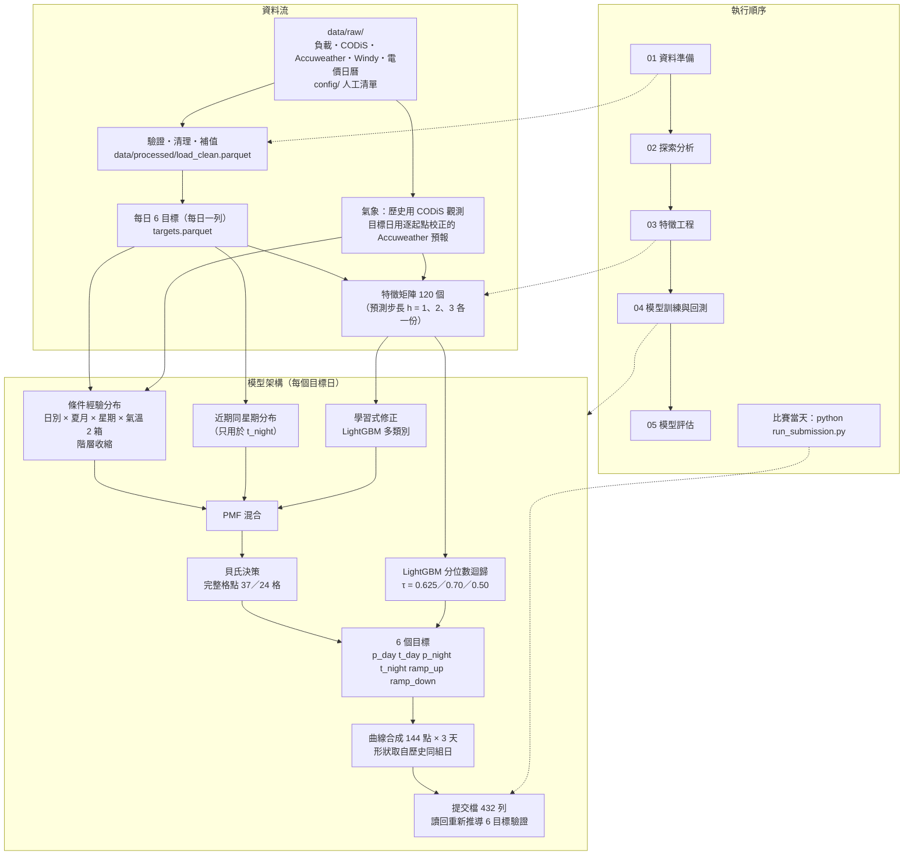
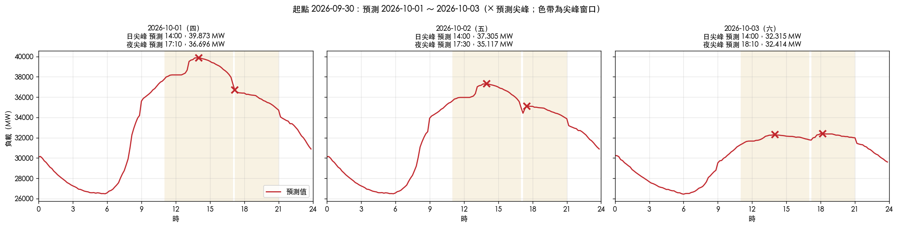
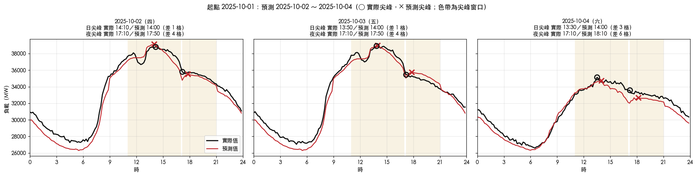
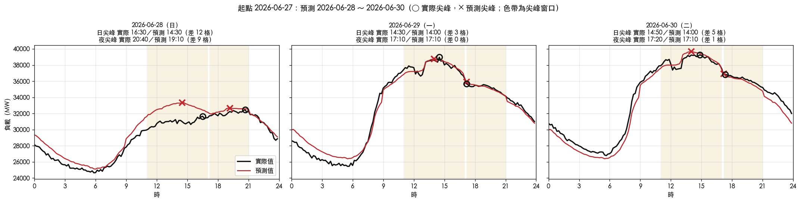

# 台灣系統瞬時負載尖峰預測

## 摘要

以 2024-01-01 起、每 10 分鐘一筆的台電系統瞬時負載，預測 **2026-10-01（四）～10-03（六）** 共 432 筆負載。
主辦單位從提交的曲線推導每天 6 個尖峰量（日、夜尖峰的負載與時刻，全日最大上升與下降）再評分。
只有一次提交機會，所以每個設計選擇都以回測證明。

評分的關鍵在於尖峰**時刻**佔總分九成以上，因此：
- 先分別預測 6 個尖峰量，再合成一條恰好實現它們的曲線。
- 時刻用「條件經驗分布 + 學習式修正」估出機率分布，再以貝氏決策在完整格點上選出期望損失最小的時刻。
- 量值用 LightGBM 分位數迴歸，分位數由評分公式推導。

以全部資料（2024-01-01～2026-09-30，共 1,004 天）建立 168 個模擬比賽情境的回測窗，total_score 為 **0.86197**；與提交日同季節的 30 窗為 **0.66723**。
最終提交的 10/1–10/3 預測見[第 4 節](#最終提交2026-10-0103)。

---

## 目錄

1. [簡介：問題與評分](#1-簡介問題與評分)
2. [資料](#2-資料)
3. [方法](#3-方法)
   - [3.1 整體流程](#31-整體流程)
   - [3.2 特徵工程](#32-特徵工程)
   - [3.3 模型](#33-模型)
   - [3.4 回測設計](#34-回測設計)
   - [3.5 參數怎麼決定](#35-參數怎麼決定)
4. [結果](#4-結果)
5. [討論與限制](#5-討論與限制)
6. [重現](#6-重現)
7. [比賽當天手動執行](#7-比賽當天手動執行)
8. [附錄](#8-附錄)

---

## 1. 簡介：問題與評分

**要交什麼**：3 天 × 144 點的 10 分鐘負載曲線，格式為 `Date_Time,Load_MW` 共 432 列。

**主辦單位從曲線推導的 6 個量**（每天各一組）：

| 量 | 定義 |
|---|---|
| $p_{day}$、$t_{day}$ | 日尖峰（11:00–17:00，37 格）的最大負載與發生時刻 |
| $p_{night}$、$t_{night}$ | 夜尖峰（17:10–21:00，24 格）的最大負載與發生時刻 |
| $ramp_{up}$、$ramp_{down}$ | 全日 143 個相鄰 10 分鐘差分（不跨日）的最大上升，以及最大下降的絕對值 |

極值並列時取最早的時刻。

**評分公式**（$N$ = 天數，下標 $a$ 為實際值、$f$ 為預測值，越低越好）：

$$s_{peak\_mw}=\frac{1}{2N}\sum_{i=1}^{N}\left(\left|\frac{p^{a}_{day}-p^{f}_{day}}{p^{a}_{day}}\right|+\left|\frac{p^{a}_{night}-p^{f}_{night}}{p^{a}_{night}}\right|\right)$$

$$s_{peak\_time}=\frac{1}{2N}\sum_{i=1}^{N}\left[\left(\frac{|t^{a}_{day}-t^{f}_{day}|}{10}\right)^{1.2}+\left(\frac{|t^{a}_{night}-t^{f}_{night}|}{10}\right)^{1.2}\right]$$

時刻以當日分鐘數計，除以 10 即相差幾格。

$$s_{ramp\_up}=\frac{1}{N}\sum\left|\frac{ramp^{a}_{up}-ramp^{f}_{up}}{ramp^{a}_{up}}\right|,\qquad s_{ramp\_down}=\frac{1}{N}\sum\left|\frac{ramp^{a}_{down}-ramp^{f}_{down}}{ramp^{a}_{down}}\right|$$

$$s_{under\_penalty}=\frac{0.2}{N}\sum\left[\max\left(0,\frac{p^{a}_{day}-p^{f}_{day}}{p^{a}_{day}}\right)+\max\left(0,\frac{p^{a}_{night}-p^{f}_{night}}{p^{a}_{night}}\right)+\max\left(0,\frac{ramp^{a}_{up}-ramp^{f}_{up}}{ramp^{a}_{up}}\right)\right]$$

$$\text{total\_score}=0.6\,s_{peak\_mw}+0.15\,s_{peak\_time}+0.15\,s_{ramp\_up}+0.1\,s_{ramp\_down}+s_{under\_penalty}$$

實作在 `src/evaluation/metrics.py`，每一項都以手算案例測試（`tests/test_metrics.py`）。

**兩個決定整個設計的事實**
1. **權重不等於重要性**：
   - 負載的相對誤差約 0.02，時刻誤差約 5 格。
   - 加權後 $s_{peak\_time}$ 佔總分 **92%**，所以心力集中在尖峰時刻。
2. **評分只看 6 個推導量**：
   - 曲線上任何一點的小誤差，都可能讓極值跳到別的時刻。
   - 因此先決定 6 個量，再合成一條恰好實現它們的曲線；時刻就完全由決策層控制。

## 2. 資料

| 資料 | 期間與頻率 | 原始欄位 | 用途 |
|---|---|---|---|
| 系統瞬時負載 `data/raw/正式競賽資料.csv` | 2024-01-01～2026-09-30，10 分鐘 | `Date_Time`、`Load_MW` | 目標與落後特徵 |
| CODiS 氣象觀測（臺北、新北、臺中、臺南、高雄五站） | 同上，逐小時 | 氣溫、紫外線、降水等 | 歷史的氣溫 |
| Accuweather 鄉鎮預報（五站對應的鄉鎮） | 2024-01-01～2026-10-03，逐小時 | 氣溫等 | 目標日的氣溫；歷史只用來校正 |
| Windy 太陽光電預測 `data/raw/Windy.csv` | 2024-01-01～2026-10-03，每 3 小時 | 6 個機組的預測發電量 | 太陽光電特徵 |
| 時間電價日曆表 | 2011–2060，每日 | 日別、國定假日、農曆、節氣 | 日曆特徵 |
| `config/` 的人工清單 | — | 電價時段規則、特殊日期區間、颱風停班停課、放假日、事件日 | 日曆特徵與資料品質 |

開發期只有到 2026-06-30 的負載（`data/raw/訓練數據範例.csv`，仍保留在 repo）；比賽當天才取得到 9/30 的正式負載檔，兩者在重疊期間完全相同。

**清理**
- **截止日**：只使用 `DATA_AVAILABLE_END`（2026-09-30）以前的負載與觀測，由程式在讀檔時過濾。預報不受截止日限制。
- **結構驗證**：讀檔時檢查欄位、型別、時間格點與連續性，不符就中止並列出差異。
- **缺漏**：
  - 缺漏的時間戳補成空值，不刪列（刪列會讓差分錯位）。
  - 零星缺值用線性內插；長段缺失取鄰近同日別日的形狀，依當日水準縮放。
- **特殊值**：CODiS 的缺測代碼轉成空值；雨跡轉成 0.1 mm。
- **重複**：完全重複的列刪除並記錄（Windy 有 122 列）。
- **時間格式**：比賽當天更新的 Windy 檔，時間從 `2024/1/1 02:00` 改成 `2024-01-01 02:00:00` 的寫法。讀檔時兩種都接受，先轉成時間型別再去重；與舊檔重疊的期間，只有最後幾天（9/16–9/18）的預報值被更新。
- **異常日**：逐日判讀過，沒有刪除任何一天。花蓮地震日只排除在量值訓練之外。

**repo 內的資料**
- 上表的檔案都已附上。
- Accuweather 的三個年度檔各 280–410 MB，超過 GitHub 單檔上限，只附區域對照表。
  - 取得後放在 `data/raw/Accuweather/`，檔名維持 `…天氣預測詳細表_<年>.csv`。
  - `python main.py check` 會列出缺少的檔案。
- 沒有年度檔時仍可閱讀 notebook 的輸出；需要年度檔的測試會自動略過。

## 3. 方法

### 3.1 整體流程



程式對應：
- 資料 `src/data/`；特徵 `src/features/`；模型 `src/models/`；評估 `src/evaluation/`。
- 端到端流程 `src/workflow.py`，提交、回測、notebook 都呼叫同一套函式。

### 3.2 特徵工程

#### 原始欄位

| 來源 | 欄位 | 意義 |
|---|---|---|
| 負載檔 | `Date_Time`、`Load_MW` | 每 10 分鐘的系統瞬時負載（MW）。一天 144 筆，00:00 到 23:50 |
| 時間電價日曆表 | 日別 | 台電計價用的日別：**平日**、**週六**、**週日及離峰日**。國定假日即使落在週一到週五，也歸為「週日及離峰日」 |
| 時間電價日曆表 | 農曆、節氣 | 例如「八月十五」、「秋分」 |
| `config/price_periods.toml` | 夏月、電價時段 | 夏月是 5/16–10/15（含端點）；各季節、各日別一天之中哪些時段屬於尖峰、半尖峰、週六半尖峰、離峰 |
| CODiS | 氣溫 | 臺北、新北、臺中、臺南、高雄五個氣象站的逐小時觀測（°C）。時間戳是區間終點，例如 `07:00` 代表 06:00–07:00 |
| Accuweather | 氣溫 | 五站對應鄉鎮的逐小時氣溫預報（°C） |
| Windy | `unit_name`、`forecast_time`、`forecast_power` | 6 個太陽光電機組，每 3 小時一筆的預測發電量 |
| `config/特殊日期區間.csv` | 類別、起、迄 | 人工整理的日期區間，例如「is_holiday，2025-01-25～2025-02-02，春節」 |
| `config/` 其他清單 | — | 颱風停班停課（含公告時間）、事件日（花蓮地震） |

#### 從負載算出的 6 個目標

每天的 144 筆負載算出 6 個數，資料從「每 10 分鐘一列」變成「每天一列」。定義見第 1 節：`t_day`、`t_night` 以當日分鐘數表示，例如 14:00 = 840。

後面的特徵都用到兩個觀念：
- **起點日 $T$**：做預測的那一天，負載只到 $T$ 23:50。
- **預測步長 $h$**：目標日減起點日，只有 1、2、3 三種。
  - 例如 $T$ = 9/30 時，10/1、10/2、10/3 分別是 $h$ = 1、2、3。
  - 模型依 $h$ 各有一份特徵矩陣，所有「過去的值」都只取到 $T$ 為止。

#### 特徵字典

下表的 `{目標}` 代表 6 個目標之一，例如 `p_day_ma7`、`t_night_lag364`。

| 類別 | 欄位 | 定義 |
|---|---|---|
| 落後值（18） | `{目標}_lag1`、`_lag7`、`_lag364` | 目標日前 1、7、364 天的實際值。364 天 = 52 週，所以是去年同星期同一天。`lag1` 只在 $h$ = 1 時存在，因為 $h$ ≥ 2 時前一天還沒發生；$h$ = 2、3 的特徵因此只有 114 個 |
| 移動統計（36） | `{目標}_ma7`、`_med7`、`_std7`、`_ma28`、`_med28`、`_std28` | 截至 $T$ 最近 7 天或 28 天的平均（ma）、中位數（med）、標準差（std） |
| 同日別（6） | `{目標}_daytype_ma4` | 截至 $T$，最近 4 個與目標日同日別的日子的平均。例如目標日是週六，就取最近 4 個週六 |
| 氣象（20） | `w_{站}_day_tmax`、`_day_tmin`、`_night_tmax`、`_night_tmin` | 各站白天（06:00–18:00）與夜晚（00:00–06:00、18:00–24:00）的最高、最低溫（°C）。歷史日用 CODiS 觀測，目標日用校正後的 Accuweather 預報（見下方） |
| 日曆（12） | `weekday` | 星期幾，1 = 週一、7 = 週日 |
| | `is_summer` | 是否為夏月（5/16–10/15） |
| | `is_offpeak_day` | 日別是否為「週日及離峰日」 |
| | `is_national_holiday` | 星期上是平日或週六，但日曆歸為離峰日，也就是國定假日 |
| | `holiday_run_length` | 當天所在的連續離峰日共幾天，例如 9 天的春節連假，每一天都是 9；不在連假中為 0 |
| | `holiday_day_index` | 當天是這段連續離峰日的第幾天，1 起算；不在連假中為 0 |
| | `is_day_before_holiday`、`is_day_after_holiday` | 隔天或前一天是否為離峰日 |
| | `day_of_year` | 一年中的第幾天，1–366 |
| | `doy_sin`、`doy_cos` | 年內位置的週期編碼 $\sin(2\pi\cdot\text{day\_of\_year}/365.25)$、$\cos(\cdot)$，讓 12/31 與 1/1 在數值上相鄰 |
| | `days_since_start` | 距資料第一天的天數 |
| 電價時段（9） | `day_share_{尖峰,半尖峰,週六半尖峰,離峰}` | 日尖峰窗口 11:00–17:00 中，各電價時段佔的時間比例。例如夏月平日 16:00 起為尖峰，`day_share_尖峰` = 1/6 |
| | `night_share_{…}` | 同上，針對夜尖峰窗口 17:10–21:00 |
| | `day_price_switches` | 日尖峰窗口內電價時段切換的次數 |
| | | 這 9 個值只由「夏月與否 × 日別」決定 |
| 天文（6） | `sunrise_min`、`sunset_min`、`solar_noon_min` | 在台灣地理中心（北緯 23.97°、東經 120.98°）的日出、日落、太陽正午時刻，以當日分鐘數表示 |
| | `noon_elevation_deg` | 正午太陽仰角（度），代表日照強度的季節變化 |
| | `day_length_min` | 晝長（分鐘） |
| | `sunset_minus_night_start` | 日落時刻減 17:10（分鐘）。負值代表太陽在夜尖峰窗口開始前就下山 |
| 特殊日期（6） | `is_holiday` | 行政機關辦公日曆的連假，例如春節、清明、端午、中秋、國慶 |
| | `is_vacation` | 中小學寒暑假 |
| | `is_sports_event` | 大型運動賽事期間（奧運、世界盃） |
| | `is_shopping_fest` | 購物節（618、雙 11） |
| | `holiday_run_len_admin`、`holiday_day_index_admin` | 依辦公日曆的連假共幾天、當天是第幾天。與上面依電價日曆的 `holiday_*` 是兩套標準：前者決定大家上不上班，後者決定計價日別，兩者大多一致但不完全相同 |
| 農曆（5） | `lunar_month`、`lunar_day` | 農曆月（1–12）、日（1–30） |
| | `days_to_lunar_festival` | 距最近的農曆大節日（春節、元宵、端午、中元、中秋、重陽）的天數。有號：正值為節前，負值為節後。這些節日在國曆上每年漂移，用月份抓不到 |
| | `solar_term_index`、`days_since_solar_term` | 目前處於第幾個節氣（0 = 立春，…，15 = 秋分），以及距該節氣開始幾天 |
| 太陽光電（2） | `pv_14` | 14:00 的預測發電量，取 5 個機組的平均 |
| | `pv_sum` | 當日 8 個 3 小時時點（02、05、…、23 時）的機組平均加總。任一時點缺機組就留空，交給 LightGBM 的缺值處理 |

**預報怎麼校正**：Accuweather 的氣溫系統性偏高，五站最高溫平均偏高約 1.2°C。
- 對每個站、每個溫度項分別擬合一條直線：觀測 = $a + b \times$ 預報。
- 擬合只用起點以前、兩者都有值的日子。
- 目標日的預報代入這條線，換算成「CODiS 尺度」後再當特徵。

**太陽光電為何只取 5 個機組**：第 6 個機組最長連續缺了 94 天。若納入平均，缺漏期間平均值的組成會改變，出現與實際發電無關的跳動。

#### 各模型實際用到的變數

| 模型 | 用到的變數 |
|---|---|
| 量值（LightGBM 分位數迴歸） | 上表全部，$h$ = 1 時 120 個 |
| 時刻：學習式修正（LightGBM 多類別） | 同上 |
| 時刻：條件經驗分布 | 只用 4 個分組條件：日別、夏月、星期、氣溫箱（3.3 節），以及歷史的 `t_day`、`t_night` |
| 時刻：近期同星期分布 | 最近 4 個同星期日的 `t_night` |

#### 篩掉的變數

- **氣象只用 4 個溫度項**：歷史用觀測、目標日用預報，兩邊必須是同一個量才接得起來。
  - CODiS 的 UV 是累積量，Accuweather 的 UV 是 1–13 的整數指數，兩者相關只有 0.43。拿掉 UV 後回測只差 0.008，在雜訊內，所以選較簡單的做法。
  - 降水、雲量同樣是兩邊定義不同。
- **刪掉 6 個從未被用來分裂的特徵**：`is_typhoon_day`、`is_typhoon_impacting`、`is_exam`、`is_lunar_festival`、`is_lunar_new_year_eve`、`night_price_switches`。
  - 以開發期資料（到 2026-06-30）訓練的全部 18 個模型中，它們一次都沒有被樹用來分裂。
  - 刪除後開發期 78 窗的逐窗分數完全相同（notebook 03）。
  - 以全部資料重算，`is_exam` 有 4 次分裂，其餘 5 個仍是 0 次；排除清單維持不變。

#### 防洩漏

- 每個特徵只用作業時點可得的資訊：
  - 目標日的氣象只用預報。
  - 颱風旗標只採用作業時點（08:30）以前已公告者。
  - 氣溫分箱的門檻與預報校正係數只用起點以前的資料。
- 落後與移動統計先算出「截至每一天」的值，再用 asof join（只往回找的合併）在 $T$ 取值，結構上取不到 $T$ 之後的資料。
- 三道測試：
  - `TestFeatureLeakage`：把某天自己的標籤改成極端值，該日的特徵都不能變。
  - `TestProductionFeatureSet`：上線特徵集必須與明列清單完全一致。
  - 回測窗測試：每個窗只看得到起點以前的資料。

### 3.3 模型

量值與時刻用兩套完全不同的方法。以下依序說明：時刻的候選格點、PMF、貝氏決策，以及 PMF 的三個來源；接著是量值的分位數迴歸；最後是曲線合成。

#### 候選格點：時刻只能是 37 或 24 個值之一

- 日尖峰窗口 11:00–17:00，每 10 分鐘一格、含兩端，共 **37 格**：11:00、11:10、…、17:00。
- 夜尖峰窗口 17:10–21:00，共 **24 格**。
- 預測的 `t_day` 必須是 37 格之一，`t_night` 必須是 24 格之一。

#### PMF：每一格是尖峰時刻的機率

PMF（probability mass function，機率質量函數）是一張「每個可能值的機率」表，所有機率加起來等於 1。
- 例如夏月平日的 `t_night`：歷史上 P(17:10) ≈ 0.77，其餘 0.23 分散在後面的格點。
- 模型不直接輸出一個時刻，而是先輸出 PMF，再由貝氏決策選出一格。

**為什麼不直接用迴歸預測時刻**：時刻的分布長得不適合迴歸。以全部 1,004 天為例：
- `t_day` 散在 36 個格點上：
  - 12:40–15:00 佔 50%
  - 15:10–16:50 佔 24%
  - 11:00–12:30 佔 17%
  - 剛好在 17:00 右端點佔 10%
- `t_night` 有 32% 剛好落在窗口第一格 17:10。傍晚負載從日尖峰往下降，17:10 常常就是夜窗口內的最大值。夏月平日更高達 77%。
- 迴歸會預測到多個叢集之間的空隙，或無法貼齊端點。

#### 貝氏決策：選期望損失最小的格點

評分對時刻的懲罰是 $(|\text{預測}-\text{實際}|/10)^{1.2}$。給定 PMF，選格點 $j$ 的期望損失是：

$$L(j)=\sum_{k} P(k)\left(\frac{|j-k|}{10}\right)^{1.2}$$

$k$ 走過所有格點。對 37（或 24）個候選 $j$ 各算一次，選 $L(j)$ 最小的。

**例子**：若 PMF 是 11:30 與 13:30 各 50%，其他格點 0。
- 選 11:30（或 13:30）：一半的機會猜對，另一半差 12 格，$L = 0.5\times 12^{1.2} \approx 9.86$。
- 選 12:30：一定差 6 格，$L = 6^{1.2} \approx 8.59$，**比較好**。

這說明三件事：
- **最佳解不是機率最高的那一格**：因為損失的指數 1.2 > 1，大錯的代價比小錯高得多，保守的中間值反而划算。
- **也不是平均值或中位數**：指數介於 1 和 2 之間，最佳解落在兩者之間，只能逐格計算。
- **候選要用完整的 37／24 格**：上例的最佳解 12:30 在歷史上可能從未出現過。只從「出現過的格點」挑，就會錯過它。

時刻的 PMF 由三個來源加權組合而成（圖見 3.1），以下分別說明。

#### 來源一：條件經驗分布

**定義**：在歷史中找出「和目標日同一組」的日子，數它們的尖峰落在哪一格，換成比例，就是 PMF。

分組用 4 個條件，都是作業時點已知的值：

| 條件 | 值 |
|---|---|
| 日別 | 平日、週六、週日及離峰日（電價日曆的分類） |
| 夏月 | 是或否（5/16–10/15） |
| 星期 | 週一到週日 |
| 氣溫箱 | 五站白天最高溫中的最高者，與「起點以前所有歷史日的中位數」比較，分成**偏低**、**偏高**兩箱 |

- 氣溫門檻在各回測窗介於 29.9–31.6°C，用全部資料算是 31.2°C。目標日的氣溫用預報。
- 以全部資料計算，4 個條件的組合實際出現 41 組，每組 1 到 64 天，中位數 14 天。

**例子**：2025-10-02 是週四、平日、夏月。若預報最高溫高於門檻，就從歷史中挑出所有「平日 × 夏月 × 週四 × 偏高」的日子，統計它們的 `t_day` 落在哪幾格。

#### 階層收縮：組太小時借用較粗的分組

分得越細，每組天數越少，頻率就越不可靠。只有 1 天的組，PMF 會變成「100% 在某一格」。所以由粗到細逐層計算，每一層都以上一層的結果當作「先驗」：

1. 從 37 格（或 24 格）的均勻分布開始。
2. 依序只用「日別」→「日別 × 夏月」→「× 星期」→「× 氣溫箱」篩選歷史。每一層都更新：

$$P_{\text{本層}}(k)=\frac{n_k+\alpha\,P_{\text{上一層}}(k)}{n+\alpha}$$

   - $n$ 是本層這一組的天數，$n_k$ 是其中尖峰落在格點 $k$ 的天數。
   - $\alpha$ 是「上一層相當於幾天的資料」。

**例子**（$\alpha$ = 5）：最細的一組只有 5 天，其中 4 天落在 17:10，上一層在 17:10 的機率是 0.6。

$$P(\text{17:10}) = \frac{4+5\times0.6}{5+5} = 0.70$$

- 組大時，$n \gg \alpha$，幾乎只看本組；組小時，較多借用上一層。
- $\alpha$ = 0 代表完全不借、只看最細的一組；$\alpha \to \infty$ 代表忽略細分組。

兩個目標用不同的 $\alpha$：
- **`t_day` 的 $\alpha$ = 0**：日尖峰很分散，夏月平日也散在 23 格，最多的一格只有 19%。氣溫箱帶來的差異才是主要訊號，收縮會把它抹平。
- **`t_night` 的 $\alpha$ = 5**：夜尖峰集中，少量借用粗分組可以減少小組的雜訊。

#### 來源二：近期同星期分布（只用於 `t_night`）

**定義**：取起點以前最近 4 個與目標日同星期幾的日子。
- 例如目標日是週四，就取最近 4 個週四。
- 用它們的 `t_night` 做一個 PMF。每格另加 0.01 天的均勻先驗，避免沒出現的格點機率為 0。

接著與條件經驗分布**各佔 0.5**：

$$P = 0.5\,P_{\text{條件經驗}} + 0.5\,P_{\text{近期}}$$

**為什麼只用於 `t_night`**：
- 夜尖峰高度集中（夏月平日 74% 在 17:10），而且會隨季節慢慢移動，最近幾週的狀態有預測力。
- 日尖峰分散在四個時段，4 個樣本的雜訊大於訊號。回測中對 `t_day` 混入近期分布沒有改善。

#### 來源三：學習式修正（LightGBM 多類別分類）

**LightGBM 是什麼**：一種梯度提升決策樹（gradient boosting decision tree）。
- 它一棵接一棵地訓練很淺的決策樹，每棵新樹專門修正前面所有樹的誤差，最後把所有樹的輸出加總。
- 適合這個專案的原因：
  - 表格資料的特徵尺度不一，有溫度、分鐘數、0/1 旗標，它都不需要標準化。
  - 它能直接處理缺值。
  - 樣本少時，限制樹的大小就能控制過擬合。

**多類別分類**：把每個格點當成一個「類別」，輸入 3.2 節的全部特徵，輸出每個類別的機率，也就是另一個 PMF。
- **類別**：訓練資料中出現至少 10 次的格點；較罕見的格點併入時間上最接近的類別，資料不丟棄。
- **訓練**：40 輪，只用起點以前的資料，每個目標日各訓練一次。
- 輸出攤回完整的 37／24 格後，與前兩個來源的結果加權混合，LightGBM 佔 **0.7**：

$$P_{\text{最終}} = 0.3\,P_{\text{來源一、二}} + 0.7\,P_{\text{LightGBM}}$$

**為什麼是「修正」而不是單獨使用**：
- 單獨用多類別模型時，37 個類別只有不到 1,000 天的訓練資料，每類平均不到 30 個樣本，模型很快就過擬合。輸出的機率也過度平坦，決策層只好往中間避險。
- 條件經驗分布的機率直接來自歷史頻率，比較可靠，但看不到溫度細節、連假、落後值等資訊。
- 混合後由 LightGBM 帶進查表看不到的訊號，查表則穩住整體形狀。
- 權重開發期用 0.5；以全部資料重新調參時 0.7 通過門檻並經 3 個種子確認，0.3 則變差（3.5 節、第 4 節）。

#### 量值：LightGBM 分位數迴歸

**分位數迴歸是什麼**：一般迴歸預測「平均會是多少」；分位數迴歸預測「有 $\tau$ 的機率不會超過的值」。
- $\tau$ = 0.5 就是中位數。
- $\tau$ = 0.625 代表預測值會比中位數略高，約 62.5% 的日子實際值不超過它。

訓練時用的損失是 pinball loss，設 $y$ 為實際、$q$ 為預測：

$$\ell_\tau(y,q)=\begin{cases}\tau\,(y-q) & y\ge q\ \text{（低估）}\\(1-\tau)\,(q-y) & y<q\ \text{（高估）}\end{cases}$$

- 讓這個損失的期望值最小的 $q$，恰好是 $y$ 的 $\tau$ 分位數。
- 4 個量值目標、3 個預測步長，各訓練一個模型，共 12 個，200 輪。

#### 分位數 τ 怎麼來

把評分公式對「低估 1%」與「高估 1%」各要付多少分拆開：

| 目標 | 高估 1% 的代價 | 低估 1% 的代價 | $\tau$ = 低估 ÷（低估 + 高估） |
|---|---|---|---|
| `p_day`、`p_night` | $s_{peak\_mw}$：$0.6\times\frac{1}{2}=0.3$ | $0.3$ + 低估懲罰 $0.2$ = $0.5$ | $0.5/(0.5+0.3)=\mathbf{0.625}$ |
| `ramp_up` | $s_{ramp\_up}$：$0.15$ | $0.15+0.2=0.35$ | $0.35/(0.35+0.15)=\mathbf{0.70}$ |
| `ramp_down` | $s_{ramp\_down}$：$0.1$ | $0.1$（無低估懲罰） | $0.1/(0.1+0.1)=\mathbf{0.50}$ |

- 為什麼是這個比例：低估每單位代價 $a$、高估每單位代價 $b$ 時，最小化期望代價的預測是 $\tau = a/(a+b)$ 分位數。這正是上面 pinball loss 的形式。
- `p_day` 的高估代價是 0.3 而不是 0.6，因為 $s_{peak\_mw}$ 是日、夜兩項的平均，每一項只分到一半的權重。
- 評分的相對誤差以實際值為分母，此推導把實際值在不同日子間的變動視為很小。

#### 曲線合成

- **錨點**：6 個預測值固定了曲線上幾個點：
  - 日尖峰窗口內在 `t_day` 達到 `p_day`
  - 夜尖峰窗口內在 `t_night` 達到 `p_night`
  - 全日最大上升等於 `ramp_up`
  - 全日最大下降等於 `ramp_down`
- **形狀模板**：錨點之間的形狀取自起點以前、與目標日同日別同夏月的最近 120 個日子。每天先把負載縮放到 0–1 再逐點取中位數，所以形狀與負載水準無關。
- **保證**：合成器確保由曲線推導出的 6 個量等於目標值，而且極大值嚴格唯一，避免並列時被取到較早的時刻。
- **修補**：少數日子模型預測的 6 個量互相衝突，組不成任何曲線。
  - 例如 `t_day` = 17:00 時，17:10 必須低於 `p_night`，下降幅度可能超過預測的 `ramp_down`。
  - 這時只放寬 `ramp_down`，必要時再放寬 `ramp_up`；時刻與尖峰負載絕不更動。
- **複核**：曲線寫成檔案後，用兩支互相獨立的程式各自讀回、推導 6 個量，並與模型預測逐項比對。
  - `src/features/targets.py`：專案本身的推導。
  - `organizer_score.py`：只用 Python 標準函式庫，依比賽規則重寫推導與評分，不 import 專案程式。
  - 回測紀錄也用同一支程式全部重算，見第 6 節的 `verify-curves`。

#### 有幾個模型、哪個最好、有沒有集成

- **每次預測都重新訓練 18 個 LightGBM**，只用起點以前的資料：
  - 量值：4 目標 × 3 個預測步長 = 12 個分位數迴歸。
  - 時刻：2 目標 × 3 個目標日 = 6 個多類別分類器。
  - 條件經驗分布與近期同星期分布是從歷史直接計數，不需訓練。
  - 一個回測窗訓練 18 個模型，168 窗共 3,024 個。
- **最佳模型**就是上述組合，設定寫在 `config/settings.py`。各種對照見第 4 節的實驗。
- **有集成，但是在機率層級**：時刻的三個 PMF 先加權平均，最後才做一次貝氏決策。
  - 不能平均兩個決策出來的時刻：兩個好答案的平均值，可能是兩個都不好的地方。
  - 多種子平均試過（第 4 節），沒有改善，不採用。

#### 設計上的轉折（都由回測決定）

- **分組要看組別平衡，不是分組數**：
  - 「日別 × 夏月」只有 6 組，其中「平日 × 非夏月」一組就有 378 天，太粗。
  - 加上星期，最大組變成 79 天，有效。
  - 改用年內位置、月份，或把氣溫分成 3 箱，都會切出只有幾天的小組，全部失敗。
- **量值改回絕對值**：
  - 原本預測「相對近期同日別中位數的比值」，理由是樹模型無法外插到訓練範圍之外。
  - 但只預測 1–3 天，負載水準不會超出訓練範圍；落後特徵本身也帶著水準資訊。
  - 回測中直接預測絕對值較好。

### 3.4 回測設計

#### 回測在回測什麼

模擬比賽當天的處境，看模型在「當時只拿得到那些資料」的條件下能拿幾分。一個**回測窗**的完整流程：

1. 選一個歷史上的**起點日 $T$**，把資料截到 $T$ 23:50。
2. 目標日 $T+1$～$T+3$ 的氣象只用 Accuweather 預報，並用 $T$ 以前的資料校正。
3. 只用 $T$ 以前的資料，重新訓練 18 個模型並建好條件經驗分布。
4. 預測 3 天的 6 個量，合成 432 點曲線，由曲線推導 6 個量。
5. 與這 3 天的實際值比較，算出 total_score 與 5 個子項。

比賽當天就是 $T$ = 9/30 的同一套流程。

```
起點 T         T+1        T+2        T+3
──────────────┼──────────┼──────────┼──────────┤
 訓練資料（到 T 23:50）  │← 預測並評分的 432 點 →│
```

#### 168 窗與 30 窗怎麼來

| 組別 | 窗數 | 起點怎麼選 | 用途 |
|---|---:|---|---|
| 全年起點 | 60 | 從 2025-02-04～2026-06-27 共 509 個可用起點中等距取 60 個，約每 8.5 天一個，第一個是 2025-02-04、最後一個是 2026-06-19。日期寫死在 `settings.BACKTEST_CV60_ORIGINS` | 涵蓋一年四季 |
| 同季節起點 | 30 | 2025-09-19～10-09 與 2026-09-19～09-27 每天一個（21 + 9） | 目標日涵蓋提交日前後約 10 天 |
| 最近一季 | 90 | 2026-06-30～09-27 每天一個，目標日 2026-07-01～09-30 | 最接近提交日的狀態 |
| **調參組** | **168** | 上面三組合併。重複的起點只算一次：2025 年同季節區間內有 3 個全年起點（9/21、9/29、10/08），2026 年同季節的 9 個起點也在最近一季裡；60 + 30 + 90 − 12 = 168 | 所有比較與參數選擇 |
| └ 同季節子集 | 30 | 調參組中起點落在兩個同季節區間的窗 | 另外把關 |

- **可用起點的範圍**：
  - 最早是 2025-02-04：起點前至少要有 400 天歷史，`lag364` 才有值；資料從 2024-01-01 開始，加 400 天就是 2025-02-04。
  - 最晚是 2026-09-27：資料到 2026-09-30，起點之後的 3 個目標日都要有實際值。
  - 全年起點的日期寫死，資料延長時這 60 窗的定義不變，前後分數才能比較。
- **為什麼是 60**：比較兩個模型靠的是逐窗差值的標準誤。20 窗的標準誤約是 60 窗的 1.7 倍，分不出小的改善。
- **為什麼加同季節窗**：
  - 60 個全年起點中，目標日落在提交季節的只有 3 窗。
  - 全年平均的時刻損失有一半以上來自冬季。只看全年平均，會挑出「修好冬季」卻對 10 月沒幫助的變體。
  - 沒有 2024 年，因為 2024 年秋天的歷史不足 400 天。
- **為什麼加最近一季**：比賽當天才取得 7–9 月的負載。這段最接近提交日的負載水準與夜尖峰位置，每天一窗把它完整用上。
- 一窗 3 天，調參組共 504 個目標日。相鄰窗的目標日可以重疊，例如連續的起點。
- 168 窗的回測約 50 分鐘（notebook 04 實測），三個回測並行時各約 80 分鐘。

**開發期的 78 窗與保留確認組**：開發期只有到 2026-06-30 的負載，調參組是全年起點 60 窗加上 2025 年同季節 21 窗，重複 3 個，共 78 窗。
當時計畫把 2026-07～09 保留下來，等最終設定選定後只確認一次。比賽當天最終模型直接用到 9/30 的全部資料訓練，
「保留」已沒有意義，因此把這段併入調參組、在 168 窗上重新調參，沒有另外執行確認組。

#### 怎麼比較兩個模型

1. 候選與參考在**同樣的 168 窗**上各跑一次，得到每窗的 total_score。
2. 逐窗相減得到 168 個差值，算平均與標準誤（標準差 ÷ $\sqrt{168}$）。
3. **門檻**：
   - 平均改善必須大於 1 個標準誤。
   - 而且同季節 30 窗不能變差超過 1 個標準誤。
4. 相鄰窗的目標日會重疊，差值並非完全獨立，所以這是篩選門檻，不是嚴格的統計檢定。
5. 通過的候選，再用另外兩個隨機種子各跑一次，方向必須一致。

**回測分數是下限估計**：Accuweather 與 Windy 的歷史檔沒有發布時間，回測用的預報比比賽當天實際拿得到的更新、更準。

### 3.5 參數怎麼決定

沒有做網格搜尋或自動調參。理由：
- 樣本只有約 1,000 天。
- 只有一次提交機會。
- 只換隨機種子，配對差就能到 1.16 個標準誤；大量搜尋幾乎一定會挑到雜訊。

參數分成三類：

| 類別 | 參數 | 怎麼決定 |
|---|---|---|
| 由評分公式推導 | 分位數 $\tau$、貝氏決策的損失、候選格點 | 直接由公式算出，不調（3.3 節） |
| 事前固定的保守值 | LightGBM：每棵樹最多 15 片葉、深度 5、每片葉至少 20 筆、學習率 0.05、L2 正則化 1.0；每棵樹隨機抽 70% 特徵、80% 樣本；量值 200 輪、時刻 40 輪 | 依樣本量選保守值，不搜尋 |
| 由回測配對比較選出 | 見下表 | 事前決定的幾個候選值逐一比較 |

| 參數 | 採用 | 比較過的值 | 依據 |
|---|---|---|---|
| 條件經驗分布的條件 | 日別 × 夏月 × 星期 × 氣溫 | 年內位置、月份、多段夏月 | 只有星期與氣溫在切分後各組仍夠大 |
| 氣溫箱數 | 2 | 1、2、3 | 3 箱切出太小的組 |
| 收縮強度 $\alpha$ | `t_day` 0、`t_night` 5 | 0、5 與更大的值 | `t_day` 不收縮較好，收縮會抹平氣溫訊號；`t_night` 只有 5 通過門檻。全部資料再試 `t_night` 0、10，都未通過門檻 |
| 近期同星期分布的權重 | `t_night` 0.5 | 0.1～0.9 | 整段都通過，取中心 0.5，不取掃描的極大值。全部資料再試 0.3、0.7，都未通過門檻 |
| 學習式修正的權重 | **0.7** | 0.3、0.5、0.7 | 開發期 78 窗 0.3、0.7 都未通過，維持 0.5；全部資料 168 窗 0.7 通過並經 3 個種子確認，改用 0.7（第 4 節） |

**取中心值、不取極大值**：在雜訊大的掃描中，分數最好的那一點通常只是運氣。取「整段都通過門檻」的中間，換一份資料也比較穩。

**比賽當天以全部資料重新調參**：取得到 9/30 的負載後，只重調上表由回測選出的 3 個權重與收縮強度，每個參數試兩個值，共 6 個變體，在執行前就決定。其他設定（特徵、氣象做法、Windy）都是開發期實驗的結論，不再重做。

**比較的規則**
1. 每個實驗的變體在執行前就決定，看到結果後不追加、不微調。
2. 門檻如 3.4 節：全體改善大於 1 個標準誤，且同季節不變差超過 1 個標準誤。
3. 通過者用另外兩個種子確認。
4. 打平時選較簡單的。

## 4. 結果

### 最終提交（2026-10-01～03）

`output/submission/1151001_submission_V2.csv`：以 2024-01-01～2026-09-30 的全部資料訓練，學習式修正權重 0.7。
下表是 `organizer_score.py` 從提交檔的 432 個值重新推導的 6 個量，與模型預測完全一致；沒有任何一天需要修補 ramp。

| 日期 | 日尖峰 $t_{day}$，$p_{day}$ | 夜尖峰 $t_{night}$，$p_{night}$ | $ramp_{up}$ | $ramp_{down}$ |
|---|---|---|---:|---:|
| 10/1（四） | 14:00，39,873 MW | 17:10，36,696 MW | 1,413 | 673 |
| 10/2（五） | 14:00，37,305 MW | 17:30，35,117 MW | 1,322 | 678 |
| 10/3（六） | 14:00，32,315 MW | 18:10，32,414 MW | 725 | 543 |

```bash
python organizer_score.py output/submission/1151001_submission_V2.csv
```



- 10/1、10/2 是平日，夜尖峰落在夜窗口開頭附近；10/3 是週六，夜尖峰在 18:10，且略高於日尖峰。

### 最終分數

honest 模式：目標日只用預報，與比賽當天相同。

| 範圍 | total_score | 重現 |
|---|---:|---|
| 調參組 168 窗 | **0.86197**（標準誤 0.043） | notebook 04，或 `python main.py backtest --label final` |
| 同季節 30 窗 | **0.66723** | 同上的 `summary.json` |
| 最近一季 90 窗（目標日 2026-07-01～09-30） | 0.73116 | 同上的 `folds.csv` |
| 3 個種子平均 | 0.85560 | 另加 `--set RANDOM_SEED=1337`、`2718` 各跑一次 |
| 60 折（全年起點） | 1.11595 | `python main.py evaluate` |
| 60 折，目標日也用觀測（只作對照） | 1.11801 | `python main.py evaluate --weather-mode observed` |
| 比賽流程演練：預測 2026-06-28～30 | 1.20249 | notebook 05 第 3 節，或 `python main.py rehearse --data-end 2026-06-27` |
| 開發期調參組 78 窗（資料到 2026-06-30，權重 0.5） | 1.04169 | commit `ec3d9a0` 的 notebook 04 |

- **168 窗與 78 窗的分數不能直接比**：新增的 90 窗都在夏月，夏月的時刻比冬季好猜，平均自然較低。比較只在同一組窗上做。
- **目標日用觀測沒有比較好**：以觀測代替預報只是對照，兩者差 0.002，在雜訊內。
- **2026-06-28～30 這一窗**：權重 0.5 時是 1.11769，0.7 時是 1.20249，主要差在 6/28（週日）的夜尖峰時刻。單一窗的雜訊很大，採用與否以 168 窗的配對比較為準。

**5 個子項**（調參組 168 窗）

| 子項 | 原始值 | 權重 | 貢獻 | 佔總分 |
|---|---:|---:|---:|---:|
| $s_{peak\_time}$ | 5.298 | 0.15 | 0.795 | **92.2%** |
| $s_{ramp\_up}$ | 0.159 | 0.15 | 0.024 | 2.8% |
| $s_{under\_penalty}$ | 0.015 | 1.00 | 0.015 | 1.7% |
| $s_{ramp\_down}$ | 0.145 | 0.10 | 0.015 | 1.7% |
| $s_{peak\_mw}$ | 0.024 | 0.60 | 0.014 | 1.6% |

同季節子集的時刻損失是 $t_{night}$ 4.06、$t_{day}$ 3.99；其他窗是 $t_{day}$ 8.55、$t_{night}$ 2.60。全年以日尖峰為主，提交的季節兩者相當。

### 以主辦單位計分程式複核

`python main.py verify-curves` 用獨立的 `organizer_score.py`，把調參組 168 窗、504 天的 432 點曲線全部重算一次（notebook 05 第 12 節）：

| 比對 | 筆數 | 不一致 | 最大差異 |
|---|---:|---:|---:|
| 預測曲線推導的 6 個量 vs 合成後的值 | 3,024 | 0 | 0 |
| 預測曲線推導的 6 個量 vs 模型原始輸出 | 3,024 | 0 | 0.000001 MW |
| 實際曲線推導的 6 個量 vs 標籤 | 3,024 | 0 | 0 |
| 逐窗 5 個子項與 total_score vs 回測紀錄 | 1,008 | 0 | 4 × 10⁻¹⁵ |

- 504 天中沒有任何一天需要修補 ramp。
- 與模型原始輸出的最大差異 0.000001 MW 是合成時的浮點誤差，對分數的影響小於 10⁻¹⁰。

### 預測曲線與實際曲線

○ 是實際尖峰、× 是預測尖峰，色帶是日、夜尖峰窗口。

**2025-10-02～04**：去年與提交日同季節、同樣週四到週六的回測窗，total_score 0.65217。



**2026-06-28～30**：只用 6/27 以前的資料、以比賽當天的流程預測，total_score 1.20249。



其他診斷圖見 notebook 05：
- 逐窗分數
- 尖峰時刻誤差分布
- 尖峰負載的預測對實際散佈圖

### 432 點的 MAPE（參考用，不是評估指標）

$\text{MAPE}=\frac{100\%}{432}\sum_{k=1}^{432}\frac{|\hat{y}_k-y_k|}{y_k}$（$\hat{y}$ 預測、$y$ 實際）。模型最佳化的是 6 個尖峰量；尖峰之間的形狀取自歷史中位數，並不針對整條曲線的貼合。
參考曲線是「起點以前最近 4 個同星期日的逐點中位數」。

| 範圍 | 本模型 | 參考曲線 |
|---|---:|---:|
| 2025-10-02～04 | 1.87% | 0.73% |
| 2026-06-28～30 | 2.22% | 3.13% |
| 調參組 168 窗平均（中位數 2.84%，範圍 1.21%–9.51%） | 3.16% | 3.68% |
| 同季節 30 窗平均 | 2.47% | 3.16% |

平均而言，本模型的曲線比參考曲線更貼近實際。但在負載很平穩的窗，例如 2025-10-02～04，單純的同星期中位數反而更貼近整條曲線。

### 以全部資料調參（168 窗）

比賽當天取得到 9/30 的負載後，在 168 窗上重新調時刻模型的 3 個參數（3.5 節）。參考是當時的設定（學習式修正權重 0.5），total_score 0.87263、同季節 0.71810。

| 變體 | 設定 | total_score | 差值 | 同季節差值 | 結論 |
|---|---|---:|---:|---:|---|
| `full_mix03` | `TIMING_LEARNED_MIX=0.3` | 0.89993 | +0.027（3.1） | +0.054（3.7） | 變差 |
| **`full_mix07`** | `TIMING_LEARNED_MIX=0.7` | **0.86197** | −0.011（1.1） | −0.051（2.3） | **通過** |
| `full_recent03` | 近期同星期權重 0.3 | 0.87195 | −0.001（0.3） | −0.001（0.1） | 未通過 |
| `full_recent07` | 近期同星期權重 0.7 | 0.87372 | +0.001（0.4） | −0.007（0.6） | 未通過 |
| `full_alpha0` | `t_night` 收縮強度 0 | 0.87461 | +0.002（1.2） | +0.001（0.4） | 變差 |
| `full_alpha10` | `t_night` 收縮強度 10 | 0.87201 | −0.001（0.9） | 0.000 | 未通過 |

括號內是差值等於幾個標準誤。只有 `full_mix07` 通過，再用另外兩個種子各跑一次參考與候選：

| 種子 | 參考（0.5） | 候選（0.7） | 差值 | 同季節差值 |
|---|---:|---:|---:|---:|
| 42 | 0.87263 | 0.86197 | −0.0107（1.14） | −0.051（2.26） |
| 1337 | 0.86506 | 0.85305 | −0.0120（1.27） | −0.054 |
| 2718 | 0.86161 | 0.85179 | −0.0098（1.08） | −0.039 |
| 三個種子平均 | 0.86643 | 0.85560 | −0.0108（1.21） | −0.048（2.46） |

三個種子方向一致，所以採用 0.7。notebook 04 第 4 節列出同樣兩張表。

**重現**：以下設定都是相對於調參前的設定（學習式修正權重 0.5）。現行設定已是 0.7，所以參考要明確寫回 0.5：

```bash
python main.py backtest --label full_ref   --set TIMING_LEARNED_MIX=0.5
python main.py backtest --label full_mix07 --set TIMING_LEARNED_MIX=0.7
python main.py backtest --label full_recent03 --set TIMING_LEARNED_MIX=0.5 --set 'TIMING_ENSEMBLE_WEIGHTS={"t_day":1.0,"t_night":0.7}'
python main.py backtest --label full_alpha0   --set TIMING_LEARNED_MIX=0.5 --set 'TIMING_SHRINKAGE_ALPHA={"t_day":0.0,"t_night":0.0}'
python main.py backtest --label full_ref_seed1337 --set TIMING_LEARNED_MIX=0.5 --set RANDOM_SEED=1337
python main.py backtest-compare --reference output/backtest/<full_ref 紀錄> --candidate output/backtest/<候選紀錄>
```

`TIMING_ENSEMBLE_WEIGHTS` 是條件經驗分布的權重，近期同星期分布佔其餘，所以 `t_night` 0.7 代表近期權重 0.3。其餘變體同理。

### 開發期實驗（資料到 2026-06-30，78 窗）

開發期做了以下實驗，決定了特徵、氣象做法與 Windy 的取捨。每個實驗只改一件事，其他設定完全相同，並與參考在同樣 78 窗上配對比較（3.4 節）。
當時學習式修正的權重是 0.5。這些紀錄由 commit `ec3d9a0` 的程式與資料產生，`git checkout ec3d9a0` 後即可用表中的設定重現。

**如何閱讀下表**
- **差值** = 候選 − 參考，正值代表變差。
- **括號**內是差值等於幾個標準誤。
- **同季節差值**是只看 21 個同季節窗的差值。
- 每一列都有回測紀錄在 `output/backtest/`，notebook 04 第 3 節列出全部。

**參考模型**：前 5 個實驗的參考是當時的現行設定，含 UV、不含 Windy，total_score 1.05629。第 6 個以後以「不含 UV」（1.06447）為參考。

| # | 實驗 | total_score | 差值 | 同季節差值 | 結論 |
|---|---|---:|---:|---:|---|
| 1 | 氣象不含 UV | 1.06447 | +0.008（0.8） | +0.002 | 打平，選較簡單的 → **採用** |
| 2 | 目標日預報不校正 | 1.08095 | +0.025（1.9） | +0.019 | 校正有效 |
| 3 | 歷史也改用預報 | 1.07603 | +0.020（1.6） | +0.010 | 歷史用觀測較好 |
| 4 | 不用氣象 | 1.08730 | +0.031（1.9） | +0.041 | 氣象有效 |
| 5 | CODiS 只到起點前一天 | 1.05936 | +0.003（0.7） | +0.001 | 代價在雜訊內 |
| 6 | 加入 Windy 太陽光電預測 | **1.04169** | −0.023（1.8） | −0.0005 | 通過，3 種子確認 → **採用** |
| 7 | 刪除 6 個未使用的特徵 | 1.06447 | 0.000 | 0.000 | 逐窗完全相同 → **採用** |
| 8 | 學習式修正權重 0.3／0.7 | 1.07946／1.06094 | +0.015／−0.004 | +0.066／−0.054 | 都未通過，維持 0.5；全部資料重調後改為 0.7 |
| 9 | 學習式模型 5 種子平均 | 1.05931 | +0.003 | +0.015 | 同季節變差 |
| 10 | 量值模型 5 種子平均 | 1.06388 | −0.001 | −0.001 | 小於雜訊，訓練時間 5 倍 |
| 11 | 遞迴預測對照 | 1.90909 | +0.845 | +0.128 | 遠差於直接預測 |

**1. 氣象不含 UV**
- **問題**：UV 在觀測與預報兩邊的定義不同，留著它是否有幫助？
- **做法**：`WEATHER_METRICS` 從 5 項（4 個溫度加 UV）改成只有 4 個溫度項，特徵少 5 個。
- **結果與解讀**：變差 0.008，只有 0.8 個標準誤，同季節幾乎不變。差異在雜訊內，打平時選較簡單的，所以拿掉 UV。

**2. 目標日預報不校正**
- **問題**：3.2 節的逐站線性校正是否必要？
- **做法**：`WEATHER_CALIBRATE=false`，目標日直接用 Accuweather 的原始預報值。
- **結果與解讀**：變差 0.025（1.9 個標準誤），同季節也變差。原因是預報系統性偏高約 1.2°C，不校正會讓目標日的氣溫特徵與分箱都偏向「熱」。

**3. 歷史也改用預報**
- **問題**：歷史用觀測、目標日用預報，兩邊來源不一致。若歷史也改用預報，讓訓練與預測的來源一致，會不會比較好？
- **做法**：`--weather-mode forecast`，訓練資料的氣象特徵也改用 Accuweather 預報。
- **結果與解讀**：變差 0.020（1.6 個標準誤）。可能的原因是觀測比預報更準確地描述了「那天到底多熱」，模型學到的關係較可靠；兩邊的尺度差異交給校正處理即可。

**4. 不用氣象**
- **問題**：氣象到底有沒有用？
- **做法**：`ENABLE_TIER1_WEATHER=false`（量值不用氣象特徵）、`TIMING_TEMPERATURE_BINS=1`（時刻不分氣溫箱）。
- **結果與解讀**：變差 0.031，同季節變差 0.041，是這批實驗中同季節損失最大的。氣象有效，尤其是 10 月初的時刻。

**5. CODiS 只到起點前一天**
- **問題**：CODiS 每天中午後才更新到前一日。比賽當天早上，起點日 9/30 的觀測可能還沒有，影響多大？
- **做法**：`--observed-lag-days 1`，每個窗都假裝起點日沒有觀測，改用校正後的預報補上。
- **結果與解讀**：只差 0.003，在雜訊內。比賽當天就算只拿到 9/29 的觀測，也不必擔心。

**6. 加入 Windy 太陽光電預測**
- **問題**：白天的太陽光電會壓低系統負載、影響日尖峰的高度與時刻，預測發電量是否有用？
- **做法**：`ENABLE_WINDY=true`，加入 `pv_14`、`pv_sum` 兩個特徵。
- **結果與解讀**：
  - 改善 0.023（1.8 個標準誤），通過門檻。
  - 再用種子 1337、2718 各跑一次，改善分別是 0.042、0.043，三個種子平均改善 0.036（2.9 個標準誤），方向一致，所以採用。
  - 但同季節幾乎持平，改善主要來自其他季節。

**7. 刪除 6 個未使用的特徵**
- **問題**：有些特徵在所有模型中從未被用來分裂，留著只是雜訊。
- **做法**：`EXCLUDED_FEATURES` 列出這 6 個特徵，見 3.2 節。
- **結果與解讀**：78 窗的逐窗分數完全相同，證明它們確實沒有作用。刪掉讓模型更簡單。

**8. 學習式修正權重 0.3、0.7**
- **問題**：LightGBM 的 PMF 與查表各佔一半（0.5）是否恰當？
- **做法**：`TIMING_LEARNED_MIX` 改成 0.3 與 0.7。
- **結果與解讀**：
  - 0.3 整體變差。
  - 0.7 整體只改善 0.004，僅 0.2 個標準誤，未通過全體門檻；同季節雖改善 0.054，但門檻要求全體先通過。
  - 兩者都沒通過，維持 0.5。
  - 全部資料的 168 窗上，0.7 的整體改善變成 0.011（1.14 個標準誤），同季節仍改善約 0.05，通過門檻並經 3 個種子確認，最終改用 0.7。

**9. 學習式模型 5 種子平均**
- **問題**：LightGBM 有隨機性，用 5 個種子各訓練一次、PMF 取平均，能否更穩？
- **做法**：`TIMING_LEARNED_N_SEEDS=5`。
- **結果與解讀**：整體沒有改善，同季節反而變差 0.015。不採用。

**10. 量值模型 5 種子平均**
- **問題**：同上，針對量值模型。
- **做法**：`MAGNITUDE_N_SEEDS=5`。
- **結果與解讀**：只改善 0.001，小於雜訊，訓練時間卻變成 5 倍。不採用。

**11. 遞迴預測對照**
- **問題**：最常見的做法是直接預測整條曲線。它和本專案「先預測 6 個量再合成」相比如何？
- **做法**：`MODEL_VARIANT=recursive_ar`。
  - 用線性自迴歸每次預測下一個 10 分鐘，輸入是前 1、2、3、6 期，以及前一天、前一週同時刻的負載。
  - 以起點前 56 天擬合，一步一步外推 432 步，再由這條曲線推導 6 個量評分。
- **結果與解讀**：total_score 1.909，遠差於本模型。
  - 外推越遠誤差累積越大。
  - 曲線上任何小誤差都可能讓尖峰時刻跳到別處。

### 預報缺漏時的備援

比賽當天 Accuweather 與 Windy 不一定涵蓋到 10/3。這組實驗在開發期的 78 窗上刻意刪掉部分預報，比較三種補救方法。實際上兩者都涵蓋到 10/3 23:00，CODiS 也到 9/30，沒有觸發任何備援。

| 方法 | 做法 |
|---|---|
| 不用氣象的模型 | 缺預報的那幾天，改用不含氣象特徵、也不分氣溫箱的模型（同實驗 4） |
| 最近一天的觀測 | 缺預報的城市，拿起點以前最後一天的 CODiS 觀測值當作預報 |
| 同月氣候值 | 缺預報的城市，拿起點以前、與目標日同月份的歷年觀測平均 |

下表是相對完整預報的分數增加量，愈小愈好（notebook 05）：

| 情境 | 不用氣象的模型 | 最近一天的觀測 | 同月氣候值 |
|---|---:|---:|---:|
| 10/3 沒有預報 | **+0.015** | +0.033 | +0.036 |
| 三天都沒有 | **+0.031** | +0.057 | +0.095 |
| 只有臺北三天沒有 | — | **+0.018**（同季節 +0.003） | +0.014（同季節 +0.013） |

**解讀**
- 整天都沒有預報時，與其猜一個溫度，不如直接不用氣象。
- 只缺部分城市時，其他城市仍有預報，用最近一天的觀測補上缺的城市即可。它在同季節的代價最小。

**採用的備援**
- 整天缺預報：那天改用不含氣象的模型。
- 部分城市缺：那些城市以最近一天的觀測補。
- Windy 不齊：那天改用不含 Windy 的模型。
- CODiS 只到 9/29：9/30 以校正後的預報補（同實驗 5）。

## 5. 討論與限制

**有效的**
- 把時刻當成機率分布，在完整格點上做貝氏決策。
- 組別平衡的條件分組。
- 學習式模型用來修正、而不是取代經驗分布。
- 目標日預報逐站校正。
- 太陽光電預測。

**無效的**：
- 更細的分組：年內位置各種解析度、月份、氣溫 3 箱。
- 單獨使用多類別模型。
- 平滑分解、PMF 高斯平滑：大部分時刻誤差來自找錯結構性的峰，不是峰附近的抖動。
- 把颱風日或放假日排除出時刻估計池，或改標為離峰日。
- UV 或特殊日期旗標當時刻條件：五類旗標在 10/1–10/3 全為 0，只會把訓練池切碎。
- 種子平均。
- 遞迴外推。

**限制**
- **時刻仍是主要誤差**，在提交季節以夜尖峰為主。
- **Windy 的改善來自其他季節**，同季節持平，對 10/1–10/3 的預期效益有限。
- **量值分位數偏低**：τ = 0.625 的意圖是約 62.5% 的日子預測不低於實際；168 窗回測中 $p_{day}$、$p_{night}$ 分別只有 37%、34%（notebook 05 散佈圖）。量值只佔總分約 3%，影響小。
- **預報沒有發布時間**：回測只能用同一份預報，分數是下限估計。
- **沒有完全未經比較的確認組**：開發期保留的 2026-07～09 在比賽當天併入調參組。調參組經過多次比較，對它有一定程度的配適；比賽當天只在 6 個事前決定的變體中選一個，並以 3 個種子確認，盡量降低這個風險。
- **單一窗的分數雜訊很大**：2026-06-28～30 這一窗，權重 0.7 反而比 0.5 差（見 4 節），差異來自 6/28（週日）的時刻，單窗不足以推翻 168 窗的比較。

## 6. 重現

**環境**：macOS、Python 3.12，只用 CPU。LightGBM 需要 OpenMP：`brew install libomp`。

```bash
python3.12 -m venv .venv
source .venv/bin/activate
pip install -r requirements.txt
```

**依序執行 notebook**：每本只讀前一本的輸出。可在 Jupyter 以 `.venv` 的 kernel 逐格執行，或用指令一次跑完：

```bash
for n in 01 02 03 04 05; do jupyter nbconvert --to notebook --execute --inplace notebooks/${n}_*.ipynb; done
```

| notebook | 內容 | 時間 |
|---|---|---|
| 01 資料準備 | 讀檔、資料更新檢查、結構驗證、清理、重建 `data/processed/` | 約 10 秒 |
| 02 探索分析 | 尖峰時刻的分布與季節結構 | 約 10 秒 |
| 03 特徵工程 | 特徵矩陣、特徵使用次數 | 約 30 秒 |
| 04 模型訓練 | 調參組 168 窗回測、以鎖定設定預測提交日、開發期實驗總表、全部資料調參總表 | 約 50 分鐘 |
| 05 模型評估 | 總表、子項、曲線比較、MAPE、診斷圖、備援、多種子確認、主辦單位計分程式複核、提交曲線 | 約 1 分鐘 |

**手動依序執行會得到一樣的產出嗎？會**，前提有三：
- 同一份資料，含 Accuweather 年度檔。
- 使用 `requirements.txt` 釘住的版本。
- 使用 `config/settings.py` 寫死的隨機種子。

實測 notebook 04 的 168 窗回測，與另外以 `python main.py backtest` 執行的 `full_mix07` 紀錄相比，total_score 同為 0.86197，逐窗分數與逐日預測完全相同。會不同的只有三處：
- 時間戳。
- notebook 04 每次都會新增一份回測紀錄 `output/backtest/<時間>_notebook_04_tuning/`，notebook 05 讀最新的一份。
- 執行時間。

**測試**

```bash
python -m pytest tests                                       # 約 3 分鐘
REGRESSION=quick python -m pytest tests/test_regression.py   # 重跑 6 折，與 output/reference/ 逐值比對
python main.py verify-curves                                 # 以主辦單位計分程式複核 notebook 04 的回測紀錄
```

**以主辦單位的方式計分**：`organizer_score.py` 模擬主辦單位，只看提交的 432 個值。
- 每天推導 6 個量：窗口內有兩個以上相同的最大值時，取最早的時刻。
- 有實際值時，再計算 5 個子項與 total_score。

```bash
python organizer_score.py output/submission/submission_latest.csv              # 每天的 6 個量
python organizer_score.py 預測.csv 實際.csv                                      # 另外算 5 個子項與 total_score
```

`verify-curves` 用它重算回測的每一條曲線，確認四件事：
- 預測曲線推導出的 6 個量，等於合成後的值。
- 與模型原始輸出相比，只有合成時放寬的 ramp 不同。
- 實際曲線推導出的 6 個量，等於標籤。
- 逐窗的 5 個子項與 total_score，等於回測紀錄。

**指令**

| 指令 | 用途 |
|---|---|
| `python run_submission.py` | 比賽當天：檢查資料、重新訓練、產出並驗證提交檔 |
| `python main.py check` | 檢查必要檔案是否到位 |
| `python main.py weather` | 補抓 CODiS 觀測到資料截止日 |
| `python main.py special-days` | 由特殊日期區間表展開每日旗標 |
| `python main.py evaluate [--weather-mode honest\|observed\|forecast]` | 60 折評估 |
| `python main.py backtest --label X [--set 名稱=值] [--compare-to 紀錄]` | 168 窗回測並寫出紀錄，可與參考配對比較 |
| `python main.py backtest-compare --reference A --candidate B` | 比較兩份回測紀錄 |
| `python main.py rehearse --data-end YYYY-MM-DD` | 比賽流程演練，並以實際負載評分（專案評分函數與主辦單位計分程式各算一次，必須相同） |
| `python main.py verify-curves [--label X]` | 以主辦單位計分程式複核一份回測紀錄的所有曲線與分數 |
| `python organizer_score.py 預測.csv [實際.csv]` | 以主辦單位的規則，從 432 個值算 6 個量與 total_score |

## 7. 比賽當天手動執行

每一步都在專案根目錄、啟用 `.venv` 後執行。

**1. 放檔案**

| 檔案 | 放置位置 |
|---|---|
| 正式負載檔（2024-01-01～2026-09-30） | `data/raw/正式競賽資料.csv` |
| Accuweather 2026 年檔 | `data/raw/Accuweather/`，同檔名覆蓋 |
| Windy | `data/raw/Windy.csv`，同檔名覆蓋 |

**2. 改兩處設定**，不改程式：
- `config/paths.py`：`LOAD_DATA_FILE = RAW_DIR / "正式競賽資料.csv"`
- `config/settings.py`：`DATA_AVAILABLE_END = "2026-09-30"`

**3. 依序執行**

```bash
source .venv/bin/activate
python main.py check        # 1. 確認檔案都在
python main.py weather      # 2. 補抓 CODiS 到 9/30
python run_submission.py    # 3. 重新訓練並產出提交檔，約 30 秒至 1 分鐘
```

`run_submission.py` 會依序執行九個步驟：
1. 資料更新檢查
2. 結構驗證
3. 前置檢查
4. 清理並重建中間檔
5. 重新訓練
6. 預測 432 筆
7. 驗證提交檔：讀回檔案，分別用專案的推導程式與 `organizer_score.py` 重算每天 6 個量，都必須與模型預測一致
8. 接受本次資料
9. 印出摘要

**4. 看摘要**，逐項確認：
- 資料版本
- 歷史區段有無變動
- CODiS 觀測到哪天
- 有無走備援
- 數值範圍
- 「主辦單位計分程式複核：6 個量與模型預測一致」這一行。若有合成時放寬的 ramp，會列出日期與改動量

**5. 提交** `output/submission/submission_latest.csv`。每次產出另存 `1151001_submission_V{n}.csv`，流水號遞增、不覆蓋。
`rehearse` 會覆蓋 `submission_latest.csv`，比賽當天不要執行。

**比賽當天的實際經過**

| 步驟 | 結果 |
|---|---|
| 資料檢查 | 負載 1,004 天，與開發期檔案在重疊期間完全相同；Accuweather 與 Windy 都涵蓋到 10/3 23:00，與舊檔的差異只在 9/16–9/18 的預報；CODiS 到 9/30 |
| 第一次 `run_submission.py` | 在結構驗證中止：Windy 的時間寫法改了。讀檔程式改成兩種寫法都接受後重跑 |
| V1（`1151001_submission_V1.csv`） | 開發期設定（學習式修正權重 0.5），沒有走備援，主辦單位計分程式複核一致 |
| 重新調參 | 調參組改為 168 窗，6 個變體中只有權重 0.7 通過並經 3 個種子確認（第 4 節） |
| **V2（`1151001_submission_V2.csv`，最終提交）** | 權重 0.7。與 V1 只差 10/2 的夜尖峰時刻（17:20 → 17:30），其他 17 個量相同 |

**常見錯誤**

| 訊息 | 處理 |
|---|---|
| `前置檢查未通過：負載只到 …` | 確認負載檔涵蓋到 9/30 23:50，以及兩處設定已改 |
| `CODiS 觀測只到 …` | 執行 `python main.py weather` |
| `CODiS 缺 … 的觀測，而 Accuweather 在 … 缺 …` | 9/30 同時沒有觀測與預報；等 CODiS 中午更新後重跑 |
| 結構驗證失敗 | 新檔的欄位或格式改變，依訊息修正檔案或讀檔程式 |
| `歷史區段有變動` 警告 | 只是警告，流程繼續；看摘要列出的筆數與範例是否合理 |

## 8. 附錄

**專案結構**

```
config/        settings.py（所有參數與開關）、paths.py（所有路徑）、電價時段規則、人工清單
data/raw/      原始資料；data/processed/ 由程式重建；manifest.json 記錄原始檔指紋
src/data/      讀檔、結構驗證、清理、補值、資料更新檢查、前置檢查
src/features/  目標計算與特徵
src/models/    時刻模型、貝氏決策、量值模型、曲線合成、組裝
src/evaluation/ 評分函數、回測、配對比較、圖表
src/output/    提交檔寫出與讀回驗證
src/workflow.py 端到端流程（提交、回測、notebook 共用）
notebooks/     01–05，附執行輸出
output/        backtest/（回測紀錄）、reference/（回歸參考）、figures/（圖）
tests/         單元測試與回歸測試
main.py        指令入口；run_submission.py 比賽當天入口；organizer_score.py 主辦單位計分程式
```

**加入新的外生變數**

先問兩個問題：
1. **提交時拿得到嗎？**
   - 只有事前已知的量、或有預報的量可以直接用。
   - 訓練與預測要用同一種來源。
2. **它是不是目標的另一種寫法？**
   - 例如別人算好的每日尖峰負載。
   - 擾動測試擋不住這種，要事先判斷，並列入 `builder.NON_FEATURE_COLUMNS`。

再決定接到哪一半：

| 路徑 | 怎麼接 | 步驟 |
|---|---|---|
| **時刻**：影響大，時刻佔總分九成以上 | 離散化後加進條件經驗分布 | ① 掛到 `workflow.prepare_context` 的 `attributes`；② 分箱門檻只用起點以前的資料計算；③ 看各組天數分布，避免切出太小的組；④ 目標日缺值要拋錯 |
| **量值**：影響小 | 加進特徵矩陣 | ① 在 `src/data/external.py` 寫載入器；② 在 `src/features/` 寫特徵函式；③ 在 `builder.build_features` 呼叫，並在 `settings` 加開關；④ 更新 `TestProductionFeatureSet` 的預期特徵集 |

最後用 `python main.py backtest --label <名稱> --set <開關>=true --compare-to <參考紀錄>` 判定，規則見 3.5 節。
