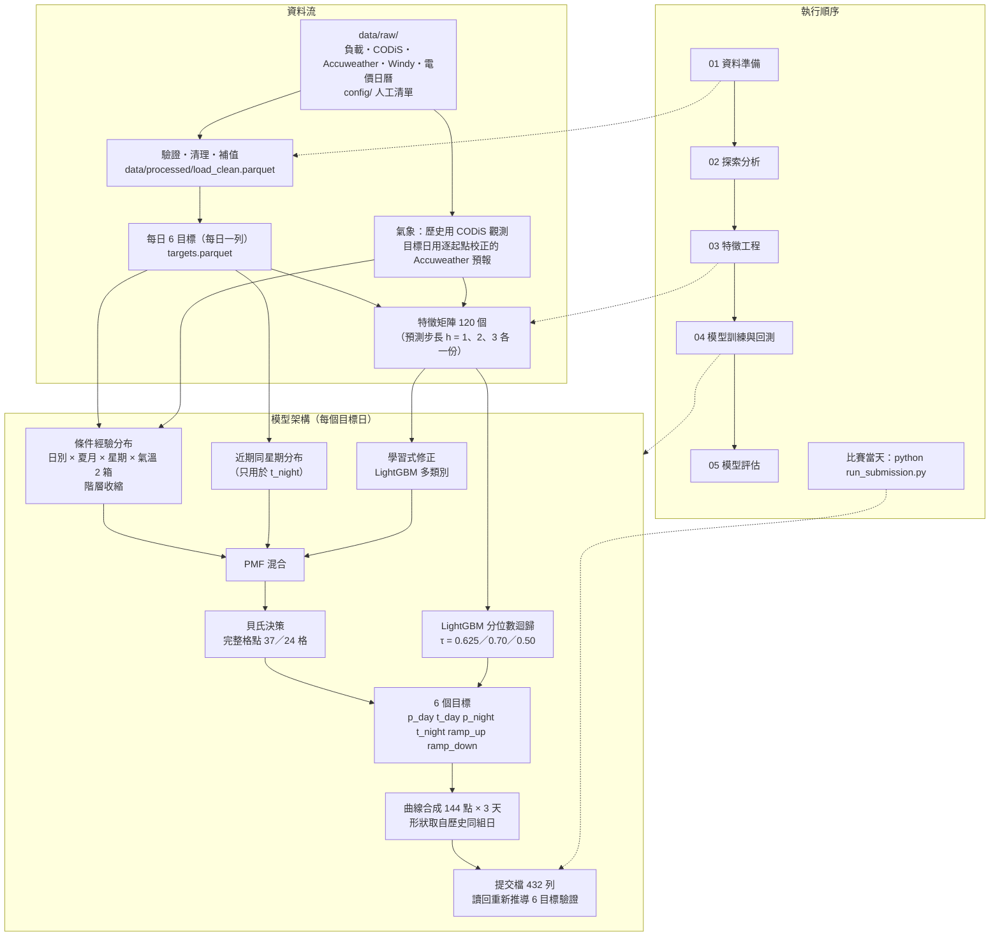

# 台灣系統瞬時負載尖峰預測

## 摘要

以 2024-01-01 起、每 10 分鐘一筆的台電系統瞬時負載，預測 **2026-10-01（四）～10-03（六）** 共 432 筆負載。
主辦單位從提交的曲線推導每天 6 個尖峰量（日、夜尖峰的負載與時刻，全日最大上升與下降）再評分。
只有一次提交機會，所以每個設計選擇都以回測證明。

評分的關鍵在於尖峰**時刻**佔總分 93%，因此：
- 先分別預測 6 個尖峰量，再合成一條恰好實現它們的曲線。
- 時刻用「條件經驗分布 + 學習式修正」估出機率分布，再以貝氏決策在完整格點上選出期望損失最小的時刻。
- 量值用 LightGBM 分位數迴歸，分位數由評分公式推導。

在 78 個模擬比賽情境的回測窗上，total_score 為 **1.04169**；與提交日同季節的 21 窗為 **0.76025**。

---

## 目錄

1. [簡介：問題與評分](#1-簡介問題與評分)
2. [資料](#2-資料)
3. [方法](#3-方法)
   - [3.1 整體流程](#31-整體流程)
   - [3.2 特徵工程](#32-特徵工程)
   - [3.3 模型](#33-模型)
   - [3.4 回測設計](#34-回測設計)
   - [3.5 參數怎麼決定](#35-參數怎麼決定)
4. [結果](#4-結果)
5. [討論與限制](#5-討論與限制)
6. [重現](#6-重現)
7. [比賽當天手動執行](#7-比賽當天手動執行)
8. [附錄](#8-附錄)

---

## 1. 簡介：問題與評分

**要交什麼**：3 天 × 144 點的 10 分鐘負載曲線，格式為 `Date_Time,Load_MW` 共 432 列。

**主辦單位從曲線推導的 6 個量**（每天各一組）：

| 量 | 定義 |
|---|---|
| $p_{day}$、$t_{day}$ | 日尖峰（11:00–17:00，37 格）的最大負載與發生時刻 |
| $p_{night}$、$t_{night}$ | 夜尖峰（17:10–21:00，24 格）的最大負載與發生時刻 |
| $ramp_{up}$、$ramp_{down}$ | 全日 143 個相鄰 10 分鐘差分（不跨日）的最大上升，以及最大下降的絕對值 |

極值並列時取最早的時刻。

**評分公式**（$N$ = 天數，下標 $a$ 為實際值、$f$ 為預測值，越低越好）：

$$s_{peak\_mw}=\frac{1}{2N}\sum_{i=1}^{N}\left(\left|\frac{p^{a}_{day}-p^{f}_{day}}{p^{a}_{day}}\right|+\left|\frac{p^{a}_{night}-p^{f}_{night}}{p^{a}_{night}}\right|\right)$$

$$s_{peak\_time}=\frac{1}{2N}\sum_{i=1}^{N}\left[\left(\frac{|t^{a}_{day}-t^{f}_{day}|}{10}\right)^{1.2}+\left(\frac{|t^{a}_{night}-t^{f}_{night}|}{10}\right)^{1.2}\right]$$

時刻以當日分鐘數計，除以 10 即相差幾格。

$$s_{ramp\_up}=\frac{1}{N}\sum\left|\frac{ramp^{a}_{up}-ramp^{f}_{up}}{ramp^{a}_{up}}\right|,\qquad s_{ramp\_down}=\frac{1}{N}\sum\left|\frac{ramp^{a}_{down}-ramp^{f}_{down}}{ramp^{a}_{down}}\right|$$

$$s_{under\_penalty}=\frac{0.2}{N}\sum\left[\max\left(0,\frac{p^{a}_{day}-p^{f}_{day}}{p^{a}_{day}}\right)+\max\left(0,\frac{p^{a}_{night}-p^{f}_{night}}{p^{a}_{night}}\right)+\max\left(0,\frac{ramp^{a}_{up}-ramp^{f}_{up}}{ramp^{a}_{up}}\right)\right]$$

$$\text{total\_score}=0.6\,s_{peak\_mw}+0.15\,s_{peak\_time}+0.15\,s_{ramp\_up}+0.1\,s_{ramp\_down}+s_{under\_penalty}$$

實作在 `src/evaluation/metrics.py`，每一項都以手算案例測試（`tests/test_metrics.py`）。

**兩個決定整個設計的事實**
1. **權重不等於重要性**：
   - 負載的相對誤差約 0.02，時刻誤差約 6 格。
   - 加權後 $s_{peak\_time}$ 佔總分 **93%**，所以心力集中在尖峰時刻。
2. **評分只看 6 個推導量**：
   - 曲線上任何一點的小誤差，都可能讓極值跳到別的時刻。
   - 因此先決定 6 個量，再合成一條恰好實現它們的曲線；時刻就完全由決策層控制。

## 2. 資料

| 資料 | 期間與頻率 | 原始欄位 | 用途 |
|---|---|---|---|
| 系統瞬時負載 `data/raw/訓練數據範例.csv` | 2024-01-01～2026-06-30，10 分鐘 | `Date_Time`、`Load_MW` | 目標與落後特徵 |
| CODiS 氣象觀測（臺北、新北、臺中、臺南、高雄五站） | 同上，逐小時 | 氣溫、紫外線、降水等 | 歷史的氣溫 |
| Accuweather 鄉鎮預報（五站對應的鄉鎮） | 2024-01-01 起，逐小時 | 氣溫等 | 目標日的氣溫；歷史只用來校正 |
| Windy 太陽光電預測 `data/raw/Windy.csv` | 2024-01-01 起，每 3 小時 | 6 個機組的預測發電量 | 太陽光電特徵 |
| 時間電價日曆表 | 2011–2060，每日 | 日別、國定假日、農曆、節氣 | 日曆特徵 |
| `config/` 的人工清單 | — | 電價時段規則、特殊日期區間、颱風停班停課、放假日、事件日 | 日曆特徵與資料品質 |

**清理**
- **截止日**：只使用 `DATA_AVAILABLE_END`（開發期 2026-06-30）以前的資料，由程式在讀檔時過濾。
- **結構驗證**：讀檔時檢查欄位、型別、時間格點與連續性，不符就中止並列出差異。
- **缺漏**：
  - 缺漏的時間戳補成空值，不刪列（刪列會讓差分錯位）。
  - 零星缺值用線性內插；長段缺失取鄰近同日別日的形狀，依當日水準縮放。
- **特殊值**：CODiS 的缺測代碼轉成空值；雨跡轉成 0.1 mm。
- **重複**：完全重複的列刪除並記錄（Windy 有 122 列）。
- **異常日**：逐日判讀過，沒有刪除任何一天。花蓮地震日只排除在量值訓練之外。

**repo 內的資料**
- 上表的檔案都已附上。
- Accuweather 的三個年度檔各 280–410 MB，超過 GitHub 單檔上限，只附區域對照表。
  - 取得後放在 `data/raw/Accuweather/`，檔名維持 `…天氣預測詳細表_<年>.csv`。
  - `python main.py check` 會列出缺少的檔案。
- 沒有年度檔時仍可閱讀 notebook 的輸出；需要年度檔的測試會自動略過。

## 3. 方法

### 3.1 整體流程



程式對應：
- 資料 `src/data/`；特徵 `src/features/`；模型 `src/models/`；評估 `src/evaluation/`。
- 端到端流程 `src/workflow.py`，提交、回測、notebook 都呼叫同一套函式。

### 3.2 特徵工程

**原始輸入**
- 負載的 `Date_Time`、`Load_MW`。
- 日曆表的日別、國定假日、農曆、節氣。
- CODiS 與 Accuweather 的逐小時氣溫。
- Windy 各機組的預測發電量。
- `config/` 的電價時段規則與日期清單。

**做了什麼**

| 步驟 | 做法 |
|---|---|
| 標籤 | 由 10 分鐘序列算出每天 6 個目標，資料轉成每日一列 |
| 落後與移動統計 | 每個目標在預測起點的落後值，以及 7／28 天的平均、中位數、標準差；同日別最近 4 次的平均。以 asof join 保證只取到起點為止 |
| 日曆與電價 | 星期、夏月、離峰日、國定假日與連假位置、年內位置；日、夜尖峰窗口內各電價時段的比例 |
| 天文 | 由經緯度算日出、日落、正午太陽仰角、晝長、日落與夜尖峰起點的距離 |
| 農曆與特殊日期 | 農曆月日、距大節日天數、節氣；由區間表展開的連假、寒暑假、運動賽事、購物節 |
| 氣象 | 五站逐小時氣溫彙總成白天（06–18 時）、夜晚的最高與最低溫。目標日的預報逐站線性校正到觀測尺度，校正只用起點以前的資料 |
| 太陽光電 | 排除資料缺漏較多的機組後，五個機組平均的 14:00 預測發電量與全日加總 |

**最後進入模型的 120 個變數**（預測步長 h = 1；h = 2、3 少了 6 個 `*_lag1`，共 114 個）：

| 類別 | 個數 | 變數 |
|---|---:|---|
| 移動統計 | 36 | 6 目標 × {`ma7`, `med7`, `std7`, `ma28`, `med28`, `std28`} |
| 落後值 | 18 | 6 目標 × {`lag1`, `lag7`, `lag364`} |
| 同日別 | 6 | 6 目標 × `daytype_ma4` |
| 氣象 | 20 | 5 站 × {`day_tmax`, `day_tmin`, `night_tmax`, `night_tmin`} |
| 日曆 | 12 | `weekday`, `is_summer`, `is_offpeak_day`, `is_national_holiday`, `holiday_run_length`, `holiday_day_index`, `is_day_before_holiday`, `is_day_after_holiday`, `day_of_year`, `doy_sin`, `doy_cos`, `days_since_start` |
| 電價時段 | 9 | 日、夜窗口各 4 個時段比例（尖峰、半尖峰、週六半尖峰、離峰），加 `day_price_switches` |
| 天文 | 6 | `sunrise_min`, `sunset_min`, `solar_noon_min`, `noon_elevation_deg`, `day_length_min`, `sunset_minus_night_start` |
| 特殊日期 | 6 | `is_holiday`, `is_vacation`, `is_sports_event`, `is_shopping_fest`, `holiday_run_len_admin`, `holiday_day_index_admin` |
| 農曆 | 5 | `lunar_month`, `lunar_day`, `days_to_lunar_festival`, `solar_term_index`, `days_since_solar_term` |
| 太陽光電 | 2 | `pv_14`, `pv_sum` |

**各模型實際吃的變數**
- 量值模型與學習式時刻模型：上表全部。
- 條件經驗分布：只用 4 個條件變數（`price_daytype`、`is_summer`、`weekday`、五站白天最高溫分 2 箱），以及歷史的時刻標籤。
- 近期同星期分布：最近 4 個同星期日的 `t_night`。

**篩掉的變數**
- **氣象只用 4 個溫度項**：歷史用觀測、目標日用預報，兩邊必須是同一個量才接得起來。
  - UV 的兩邊定義不同，相關只有 0.43；拿掉後回測只差 0.008，在雜訊內，選較簡單的做法。
  - 降水、雲量同樣定義不同。
- **刪掉 6 個從未被用來分裂的特徵**：`is_typhoon_day`、`is_typhoon_impacting`、`is_exam`、`is_lunar_festival`、`is_lunar_new_year_eve`、`night_price_switches`。刪除後逐窗分數完全相同（notebook 03）。

**防洩漏**
- 每個特徵只用作業時點可得的資訊：
  - 目標日的氣象只用預報。
  - 颱風旗標只採用作業時點（08:30）以前已公告者。
  - 分箱門檻與校正係數只用起點以前的資料。
- 三道測試：
  - `TestFeatureLeakage`：把某天自己的標籤改成極端值，該日的特徵不能變。
  - `TestProductionFeatureSet`：上線特徵集必須與明列清單一致。
  - 回測窗測試：每個窗只看得到起點以前的資料。

### 3.3 模型

**時刻（$t_{day}$、$t_{night}$）：機率分布 + 貝氏決策**
- **為什麼不用回歸**：
  - 時刻有邊界堆積：$t_{day}$ 有 10.7% 落在 17:00，$t_{night}$ 有 28% 落在 17:10。
  - $t_{day}$ 有三個叢集，回歸會預測到叢集之間的空隙。
  - 評分是誤差的 1.2 次方，最佳決策既不是眾數，也不是平均或中位數。
- **做法**：先估出每個格點的機率（PMF），再在完整格點上選期望損失 $\sum_k P(k)\,(|j-k|/10)^{1.2}$ 最小的 $j$。
  - 最佳解可以落在歷史上從未出現的時刻，例如雙峰之間。
- **PMF 由三部分在機率層級組合**：
  1. **條件經驗分布**：歷史上與目標日同一組的時刻頻率。分組是日別 × 夏月 × 星期 × 氣溫 2 箱，組太小時階層收縮到較粗的分組。
  2. **近期同星期分布**：最近 4 個同星期日，權重 0.5，只用於 $t_{night}$。夜尖峰高度集中在 17:10，時近性有用；日尖峰是三峰分布，近 4 天太雜。
  3. **學習式修正**：LightGBM 多類別模型的 PMF 以權重 0.5 混入。

**量值（$p_{day}$、$p_{night}$、$ramp_{up}$、$ramp_{down}$）：LightGBM 分位數迴歸**
- 評分對低估與高估的邊際成本不對稱，最佳預測是分位數 $\tau = \dfrac{\text{低估成本}}{\text{低估成本}+\text{高估成本}}$：
  - 尖峰負載：$0.5 / (0.5 + 0.3) = 0.625$
  - $ramp_{up}$：$0.35 / (0.35 + 0.15) = 0.70$
  - $ramp_{down}$：沒有低估懲罰，$0.50$

**曲線合成**
- 把 6 個量當作錨點，錨點之間的形狀取自起點以前、同日別同夏月的歷史日中位數形狀。
- 合成器保證推導出的 6 個量等於目標、極大值嚴格唯一。
- 寫檔後讀回，用同一支推導程式逐項比對。

**有幾個模型、哪個最好、有沒有集成**
- **每次預測都重新訓練 18 個 LightGBM**，只用起點以前的資料：
  - 量值：4 目標 × 3 個預測步長 = 12 個分位數迴歸。
  - 時刻：2 目標 × 3 個目標日 = 6 個多類別分類器。
  - 條件經驗分布與近期同星期分布是查表，不需訓練。
  - 一個回測窗訓練 18 個模型，78 窗共 1,404 個。
- **最佳模型**就是上述組合，設定寫在 `config/settings.py`。對照組見第 4 節的實驗表。
- **有集成，但是在機率層級**：時刻的三個 PMF 先加權平均，最後才做一次貝氏決策。
  - 不能平均兩個決策出來的時刻，平均值可能落在兩個都不好的地方。
  - 多種子平均試過，沒有改善，不採用。

**設計上的轉折**（都由回測決定）
- **單獨用 GBDT 預測時刻，輸給查表**：
  - 37 類 × 約 850 列，每類不到 30 個樣本，模型很快就過擬合。
  - 輸出的機率過度平坦，決策層只好往中間避險。
  - 改成只修正查表，就穩定改善。
- **分組要看組別平衡，不是分組數**：
  - 加星期有效，因為它把最大的一組（378 天）拆成最多 79 天。
  - 年內位置、月份、氣溫 3 箱都把組切得太碎而失敗。
- **量值改回絕對值**：
  - 原本預測「相對近期同日別中位數的比值」。
  - 但只預測 1–3 天，水準不會超出訓練範圍；落後特徵本身就帶水準資訊。
  - 回測中絕對值空間較好。

### 3.4 回測設計

**回測在回測什麼**：模擬比賽當天的處境，看模型在「當時只拿得到那些資料」的條件下能拿幾分。
- 對歷史上的某個起點日 $T$，假裝現在是 $T$ 的隔天早上：
  - 負載只到 $T$ 23:50。
  - 目標日的氣象只用 Accuweather 預報，逐起點校正。
  - 只用 $T$ 以前的資料重新訓練全部模型。
- 預測 $T+1$～$T+3$ 的 432 點，再用這三天的實際值計算 total_score。
- 這就是比賽當天的流程：$T$ = 9/30，預測 10/1–10/3。

**「窗」是什麼**：一個起點日 $T$ 加上它的三個目標日，就是一個回測窗。

```
起點 T         T+1        T+2        T+3
──────────────┼──────────┼──────────┼──────────┤
 訓練資料（到 T 23:50）  │← 預測並評分的 432 點 →│
```

| 組別 | 窗數 | 起點 | 用途 |
|---|---:|---|---|
| 調參組 | 78 | 60 個全年均勻分布的起點（日期寫死）＋ 2025-09-19～10-09 每天一個起點（21 個），其中 3 個重複 | 所有比較、特徵增刪、參數選擇 |
| └ 同季節子集 | 21 | 目標日落在 9/20–10/12 | 與提交日同季節，另外把關 |
| 保留確認組 | 90 | 目標日 2026-07-01～09-30，每天一窗 | 最終設定選定後只用一次；程式會擋下未確認的使用 |

- 一窗 3 天，調參組共 234 個目標日；各窗的目標日可以重疊。
- 加入同季節子集的原因：全年平均的損失有一半以上來自冬季，只看全年平均會挑出「修好冬季」卻對 10 月沒幫助的變體。
- 回測分數是**下限估計**：Accuweather 與 Windy 的歷史檔沒有發布時間，回測用的預報比比賽當天拿到的更新。

### 3.5 參數怎麼決定

沒有做網格搜尋或自動調參。理由有三：
- 樣本只有約 900 天。
- 只有一次提交機會。
- 換隨機種子本身就能讓配對差到 1.16 個標準誤；大量搜尋幾乎一定會挑到雜訊。

參數分成三類：

| 類別 | 參數 | 怎麼決定 |
|---|---|---|
| 由評分公式推導 | 分位數 τ、決策的損失函數、候選格點 | 直接由公式算出，不調 |
| 事前固定的保守值 | LightGBM：`num_leaves` 15、`max_depth` 5、`min_data_in_leaf` 20、`learning_rate` 0.05、L2 1.0、特徵與樣本抽樣 0.7／0.8；量值 200 輪、時刻 40 輪 | 依樣本量選保守值，不搜尋 |
| 由回測配對比較選出 | 時刻的條件變數、氣溫分箱數（2）、收縮強度（`t_day` 0、`t_night` 5）、近期分布權重（0.5）、學習式混合權重（0.5）、特徵增刪、備援做法 | 事前登記的變體逐一比較 |

**比較的規則**
1. 每個實驗的變體在執行前就決定，看到結果後不追加、不微調。
2. 候選與參考在同一組 78 窗上配對比較。**全體改善須大於 1 個標準誤**，而且**同季節子集不能變差超過 1 個標準誤**。
3. 通過門檻的候選，再用另外兩個種子各跑一次，方向必須一致。
4. 打平時選較簡單的。
5. 掃描參數時取「整段通過門檻」的中心，不取掃描的極大值。

## 4. 結果

**最終分數**（honest 模式，目標日只用預報）

| 範圍 | total_score | 重現 |
|---|---:|---|
| 調參組 78 窗 | **1.04169**（標準誤 0.068） | notebook 04，或 `python main.py backtest --label final` |
| 同季節 21 窗 | **0.76025** | 同上的 `summary.json` |
| 3 個種子平均 | 1.03275 | 另加 `--set RANDOM_SEED=1337`、`2718` 各跑一次 |
| 60 折 | 1.12801 | `python main.py evaluate` |
| 60 折，目標日也用觀測（樂觀，只作對照） | 1.11240 | `python main.py evaluate --weather-mode observed` |
| 比賽流程演練：預測 2026-06-28～30 | 1.11769 | `python main.py rehearse --data-end 2026-06-27` |

**5 個子項**（調參組 78 窗）

| 子項 | 原始值 | 權重 | 貢獻 | 佔總分 |
|---|---:|---:|---:|---:|
| $s_{peak\_time}$ | 6.488 | 0.15 | 0.973 | **93.4%** |
| $s_{ramp\_up}$ | 0.174 | 0.15 | 0.026 | 2.5% |
| $s_{ramp\_down}$ | 0.148 | 0.10 | 0.015 | 1.4% |
| $s_{peak\_mw}$ | 0.024 | 0.60 | 0.015 | 1.4% |
| $s_{under\_penalty}$ | 0.013 | 1.00 | 0.013 | 1.3% |

同季節子集的時刻損失是 $t_{night}$ 5.29、$t_{day}$ 3.99：在提交的季節，夜尖峰比日尖峰難。

**預測曲線與實際曲線**：2025-10-02～04 是去年與提交日同季節、同樣週四到週六的回測窗。
○ 是實際尖峰、× 是預測尖峰，色帶是日、夜尖峰窗口。


開發期最後三天（2026-06-28～30）與其他診斷圖見 notebook 05：
- 逐窗分數
- 尖峰時刻誤差分布
- 尖峰負載的預測對實際散佈圖

**432 點的 MAPE（參考用，不是評估指標）**

$\text{MAPE}=\frac{100\%}{432}\sum_{k=1}^{432}\frac{|\hat{y}_k-y_k|}{y_k}$（$\hat{y}$ 預測、$y$ 實際）。模型最佳化的是 6 個尖峰量；尖峰之間的形狀取自歷史中位數，並不針對整條曲線的貼合。
參考曲線是「起點以前最近 4 個同星期日的逐點中位數」。

| 範圍 | 本模型 | 參考曲線 |
|---|---:|---:|
| 2025-10-02～04 | 1.86% | 0.73% |
| 2026-06-28～30 | 2.24% | 3.13% |
| 調參組 78 窗平均（中位數 2.82%，範圍 1.21%–9.74%） | 3.17% | 3.94% |
| 同季節 21 窗平均 | 2.50% | 3.04% |

平均而言，本模型的曲線比參考曲線更貼近實際。但在負載很平穩的窗，例如 2025-10-02～04，單純的同星期中位數反而更貼近整條曲線。

**實驗**：差值為正代表變差，括號內是標準誤倍數。每一列都有回測紀錄在 `output/backtest/`，notebook 04 列出全部。

| 實驗 | 對照 | total_score | 差值 | 同季節差值 | 結論 |
|---|---|---:|---:|---:|---|
| 氣象不含 UV | 含 UV、不含 Windy（1.05629） | 1.06447 | +0.008（0.8） | +0.002 | 打平，選較簡單的 → **採用** |
| 目標日預報不校正 | 同上 | 1.08095 | +0.025（1.9） | +0.019 | 校正有效 |
| 歷史也改用預報 | 同上 | 1.07603 | +0.020（1.6） | +0.010 | 歷史用觀測較好 |
| 不用氣象 | 同上 | 1.08730 | +0.031（1.9） | +0.041 | 氣象有效 |
| CODiS 只到起點前一天 | 同上 | 1.05936 | +0.003（0.7） | +0.001 | 比賽當天上午的情況，代價在雜訊內 |
| 加入 Windy 太陽光電預測 | 不含 UV（1.06447） | **1.04169** | −0.023（1.8） | −0.0005 | 通過，3 種子平均 −0.036（2.9）→ **採用** |
| 刪除 6 個未使用的特徵 | 同上 | 1.06447 | 0.000 | 0.000 | 逐窗完全相同 → **採用** |
| 時刻學習權重 0.3／0.7 | 同上 | 1.07946／1.06094 | +0.015／−0.004 | +0.066／−0.054 | 皆未通過，維持 0.5 |
| 時刻學習模型 5 種子平均 | 同上 | 1.05931 | +0.003 | +0.015 | 同季節變差 |
| 量值模型 5 種子平均 | 同上 | 1.06388 | −0.001 | −0.001 | 小於雜訊，訓練時間 5 倍 |
| 遞迴預測：10 分鐘一步的 AR 外推 432 步 | 同上 | 1.90909 | +0.845 | +0.128 | 遠差於直接預測 |

**預報缺漏時的備援**：分數增加量，愈小愈好（notebook 05）。

| 情境 | 不用氣象的模型 | 最近一天的觀測 | 同月氣候值 |
|---|---:|---:|---:|
| 10/3 沒有預報 | **+0.015** | +0.033 | +0.036 |
| 三天都沒有 | **+0.031** | +0.057 | +0.095 |
| 只有臺北三天沒有 | — | **+0.018**（同季節 +0.003） | +0.014（同季節 +0.013） |

採用的備援：
- 整天缺預報：那天改用不含氣象的模型。
- 部分城市缺：那些城市以最近一天的觀測補。
- Windy 不齊：那天改用不含 Windy 的模型。
- CODiS 只到 9/29：9/30 以校正後的預報補。

## 5. 討論與限制

**有效的**
- 把時刻當成機率分布，在完整格點上做貝氏決策。
- 組別平衡的條件分組。
- 學習式模型用來修正、而不是取代經驗分布。
- 目標日預報逐站校正。
- 太陽光電預測。

**無效的**：
- 更細的分組：年內位置各種解析度、月份、氣溫 3 箱。
- 單獨使用多類別模型。
- 平滑分解、PMF 高斯平滑：大部分時刻誤差來自找錯結構性的峰，不是峰附近的抖動。
- 把颱風日或放假日排除出時刻估計池，或改標為離峰日。
- UV 或特殊日期旗標當時刻條件：五類旗標在 10/1–10/3 全為 0，只會把訓練池切碎。
- 種子平均。
- 遞迴外推。

**限制**
- **時刻仍是主要誤差**，在提交季節以夜尖峰為主。
- **Windy 的改善來自其他季節**，同季節持平，對 10/1–10/3 的預期效益有限。
- **量值分位數偏低**：τ = 0.625 的意圖是約 62.5% 的日子預測不低於實際；回測中 $p_{day}$、$p_{night}$ 分別只有 47%、39%（notebook 05 散佈圖）。量值只佔總分約 4%，影響小。
- **預報沒有發布時間**：回測只能用同一份預報，分數是下限估計。
- **調參組經過多次比較**，對它有一定程度的配適。最終以保留確認組檢查，需要涵蓋到 2026-09-30 的負載檔：
  ```bash
  python main.py backtest --group holdout --label final --confirm-holdout
  ```

## 6. 重現

**環境**：macOS、Python 3.12，只用 CPU。LightGBM 需要 OpenMP：`brew install libomp`。

```bash
python3.12 -m venv .venv
source .venv/bin/activate
pip install -r requirements.txt
```

**依序執行 notebook**：每本只讀前一本的輸出。可在 Jupyter 以 `.venv` 的 kernel 逐格執行，或用指令一次跑完：

```bash
for n in 01 02 03 04 05; do jupyter nbconvert --to notebook --execute --inplace notebooks/${n}_*.ipynb; done
```

| notebook | 內容 | 時間 |
|---|---|---|
| 01 資料準備 | 讀檔、資料更新檢查、結構驗證、清理、重建 `data/processed/` | 約 10 秒 |
| 02 探索分析 | 尖峰時刻的分布與季節結構 | 約 10 秒 |
| 03 特徵工程 | 特徵矩陣、特徵使用次數 | 約 30 秒 |
| 04 模型訓練 | 調參組 78 窗回測、以鎖定設定預測、實驗總表 | 約 16 分鐘 |
| 05 模型評估 | 總表、子項、曲線比較、MAPE、診斷圖、備援、多種子確認 | 約 30 秒 |

**手動依序執行會得到一樣的產出嗎？會**，前提有三：
- 同一份資料，含 Accuweather 年度檔。
- 使用 `requirements.txt` 釘住的版本。
- 使用 `config/settings.py` 寫死的隨機種子。

實測重跑 notebook 04 得到完全相同的 1.04169，逐窗分數與逐日預測也相同。會不同的只有三處：
- 時間戳。
- notebook 04 每次都會新增一份回測紀錄 `output/backtest/<時間>_notebook_04_tuning/`，notebook 05 讀最新的一份。
- 執行時間。

**測試**

```bash
python -m pytest tests                                       # 約 3 分鐘
REGRESSION=quick python -m pytest tests/test_regression.py   # 重跑 6 折，與 output/reference/ 逐值比對
```

**指令**

| 指令 | 用途 |
|---|---|
| `python run_submission.py` | 比賽當天：檢查資料、重新訓練、產出並驗證提交檔 |
| `python main.py check` | 檢查必要檔案是否到位 |
| `python main.py weather` | 補抓 CODiS 觀測到資料截止日 |
| `python main.py special-days` | 由特殊日期區間表展開每日旗標 |
| `python main.py evaluate [--weather-mode honest\|observed\|forecast]` | 60 折評估 |
| `python main.py backtest --label X [--set 名稱=值] [--compare-to 紀錄] [--group holdout --confirm-holdout]` | 回測並寫出紀錄，可與參考配對比較 |
| `python main.py backtest-compare --reference A --candidate B` | 比較兩份回測紀錄 |
| `python main.py rehearse --data-end YYYY-MM-DD` | 比賽流程演練，並以實際負載評分 |

## 7. 比賽當天手動執行

08:00 取得正式負載檔，15:00 前提交。每一步都在專案根目錄、啟用 `.venv` 後執行。

**1. 放檔案**

| 檔案 | 放置位置 |
|---|---|
| 正式負載檔（2024-01-01～2026-09-30） | `data/raw/正式數據.csv` |
| Accuweather 2026 年檔 | `data/raw/Accuweather/`，同檔名覆蓋 |
| Windy | `data/raw/Windy.csv`，同檔名覆蓋 |

**2. 改兩處設定**，不改程式：
- `config/paths.py`：`LOAD_DATA_FILE = RAW_DIR / "正式數據.csv"`
- `config/settings.py`：`DATA_AVAILABLE_END = "2026-09-30"`

**3. 依序執行**

```bash
source .venv/bin/activate
python main.py check        # 1. 確認檔案都在
python main.py weather      # 2. 補抓 CODiS（中午前通常只到 9/29）
python run_submission.py    # 3. 重新訓練並產出提交檔，約 30 秒至 1 分鐘
```

`run_submission.py` 會依序執行九個步驟：
1. 資料更新檢查
2. 結構驗證
3. 前置檢查
4. 清理並重建中間檔
5. 重新訓練
6. 預測 432 筆
7. 驗證提交檔
8. 接受本次資料
9. 印出摘要

**4. 看摘要**，逐項確認：
- 資料版本
- 歷史區段有無變動
- CODiS 觀測到哪天
- 有無走備援
- 數值範圍

**5. 提交** `output/submission/submission_latest.csv`。每次產出另存 `1151001_submission_V{n}.csv`，流水號遞增、不覆蓋。

| 時間 | 步驟 |
|---|---|
| 08:00–08:40 | 放檔、改設定、`check`、`weather` |
| 08:40–09:15 | `run_submission.py` 產出**保底提交檔**並檢查摘要 |
| 12:30–14:00 | CODiS 更新到 9/30 或拿到更新的預報時，重跑 `weather` 與 `run_submission.py` |
| 14:30 前 | 提交 |

**常見錯誤**

| 訊息 | 處理 |
|---|---|
| `前置檢查未通過：負載只到 …` | 確認負載檔涵蓋到 9/30 23:50，以及兩處設定已改 |
| `CODiS 觀測只到 …` | 執行 `python main.py weather` |
| `CODiS 缺 … 的觀測，而 Accuweather 在 … 缺 …` | 9/30 同時沒有觀測與預報；等 CODiS 中午更新後重跑 |
| 結構驗證失敗 | 新檔的欄位或格式改變，依訊息修正檔案 |
| `歷史區段有變動` 警告 | 只是警告，流程繼續；看摘要列出的筆數與範例是否合理 |

## 8. 附錄

**專案結構**

```
config/        settings.py（所有參數與開關）、paths.py（所有路徑）、電價時段規則、人工清單
data/raw/      原始資料；data/processed/ 由程式重建；manifest.json 記錄原始檔指紋
src/data/      讀檔、結構驗證、清理、補值、資料更新檢查、前置檢查
src/features/  目標計算與特徵
src/models/    時刻模型、貝氏決策、量值模型、曲線合成、組裝
src/evaluation/ 評分函數、回測、配對比較、圖表
src/output/    提交檔寫出與讀回驗證
src/workflow.py 端到端流程（提交、回測、notebook 共用）
notebooks/     01–05，附執行輸出
output/        backtest/（回測紀錄）、reference/（回歸參考）、figures/（圖）
tests/         單元測試與回歸測試
main.py        指令入口；run_submission.py 比賽當天入口
```

**加入新的外生變數**

先問兩個問題：
1. **提交時拿得到嗎？**
   - 只有事前已知的量、或有預報的量可以直接用。
   - 訓練與預測要用同一種來源。
2. **它是不是目標的另一種寫法？**
   - 例如別人算好的每日尖峰負載。
   - 擾動測試擋不住這種，要事先判斷，並列入 `builder.NON_FEATURE_COLUMNS`。

再決定接到哪一半：

| 路徑 | 怎麼接 | 步驟 |
|---|---|---|
| **時刻**：影響大，時刻佔總分九成以上 | 離散化後加進條件經驗分布 | ① 掛到 `workflow.prepare_context` 的 `attributes`；② 分箱門檻只用起點以前的資料計算；③ 看各組天數分布，避免切出太小的組；④ 目標日缺值要拋錯 |
| **量值**：影響小 | 加進特徵矩陣 | ① 在 `src/data/external.py` 寫載入器；② 在 `src/features/` 寫特徵函式；③ 在 `builder.build_features` 呼叫，並在 `settings` 加開關；④ 更新 `TestProductionFeatureSet` 的預期特徵集 |

最後用 `python main.py backtest --label <名稱> --set <開關>=true --compare-to <參考紀錄>` 判定，規則見 3.5 節。
